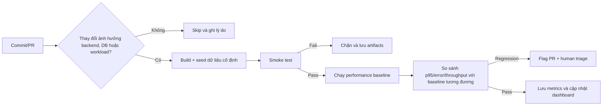

# Kiến thức nền tảng cho HW05 – Performance Testing

## 1. Bản chất của kiểm thử hiệu năng

Kiểm thử hiệu năng trả lời câu hỏi hệ thống hoạt động như thế nào dưới một mô hình tải xác định. Nó không chỉ đo “nhanh hay chậm”, mà phải gắn bốn yếu tố:

1. **Workload**: bao nhiêu virtual user (VU), tốc độ đến, ramp-up, thời gian giữ tải, think time và tỉ lệ các nghiệp vụ.
2. **Kết quả phía client**: response time, latency, throughput, error rate, response code và phân vị.
3. **Tài nguyên phía server**: CPU, RAM, disk I/O, network, số connection và dấu hiệu nghẽn.
4. **Tính đúng chức năng**: phản hồi nhanh nhưng sai, bị 401/500 hoặc không tạo dữ liệu vẫn là thất bại.

Kết luận chỉ có ý nghĩa khi bốn yếu tố được quan sát trong cùng khoảng thời gian và trên cùng cấu hình.

## 2. Load, Stress, Spike và Soak

| Kiểu test | Câu hỏi chính | Hình tải | Kết quả cần tìm |
| --- | --- | --- | --- |
| Load | Hệ thống có đáp ứng tải dự kiến không? | Tăng dần rồi giữ ổn định | p95, error rate, throughput và tài nguyên ở tải bình thường |
| Stress | Giới hạn và cách suy giảm ở đâu? | Tăng theo từng bậc vượt tải dự kiến | bậc ổn định cuối, saturation point, failure mode |
| Spike | Hệ thống chịu tải tăng đột ngột và hồi phục ra sao? | Nhảy nhanh lên tải cao rồi hạ | latency/error trong spike và thời gian hồi phục |
| Soak/endurance | Hệ thống có ổn định khi chạy kéo dài không? | Tải vừa phải, giữ 10–15 phút theo đề | rò rỉ bộ nhớ, tích tụ latency, ngưỡng bền vững trên máy |

Ba kế hoạch bắt buộc Load/Stress/Spike phải dùng **cùng một workflow end-to-end**. Soak là phép đo bổ sung để tìm endurance threshold, không thay thế ba kế hoạch.

## 3. Mô hình workload

### Virtual user, concurrency và arrival rate

- **VU/thread** mô phỏng một luồng người dùng tuần tự.
- **Concurrency** là số giao dịch/yêu cầu đang hoạt động cùng lúc, không đồng nhất với số thread.
- **Arrival rate** là số iteration hoặc request bắt đầu trong một đơn vị thời gian.
- Khi dùng mô hình thread đóng của JMeter, response time tăng sẽ khiến mỗi thread hoàn thành ít iteration hơn; vì vậy throughput có thể tự giảm dù thread count không đổi.

### Ramp-up, steady state và ramp-down

- **Ramp-up** tránh đưa toàn bộ tải vào cùng một mili giây, đồng thời cho thấy hệ thống phản ứng khi tải tăng.
- **Steady state** là khoảng đo chính sau warm-up.
- **Ramp-down/recovery** cho thấy hệ thống có trở lại bình thường sau tải hay không.
- Không trộn warm-up với cửa sổ đo nếu mục tiêu là so sánh ổn định giữa các run.

### Think time và pacing

Think time mô phỏng khoảng người dùng đọc hoặc nhập dữ liệu giữa hai hành động. Pacing kiểm soát khoảng cách giữa hai vòng nghiệp vụ. Bỏ cả hai sẽ biến workflow admin thành vòng lặp ghi dữ liệu tối đa, phù hợp với stress có chủ đích nhưng không đại diện tải thực tế. Cần ghi rõ timer nào áp dụng cho Load, Stress và Spike.

## 4. Chỉ số quan trọng

### Response time, latency và connect time

- **Elapsed/response time**: từ lúc gửi đến khi nhận xong phản hồi.
- **Latency** trong JMeter: thường là thời gian đến byte phản hồi đầu tiên; không phải toàn bộ response time.
- **Connect time**: thời gian thiết lập kết nối TCP/TLS.

Không được dùng ba khái niệm thay nhau. Với localhost, connect time thường nhỏ; elapsed tăng có thể đến từ event loop, SQLite hoặc hàng đợi ghi.

### Mean, median và percentile

- **Mean** nhạy với outlier.
- **Median/p50**: 50% mẫu không vượt giá trị này.
- **p95**: 95% mẫu có response time nhỏ hơn hoặc bằng giá trị p95; đây không phải maximum.
- **p99** cho biết phần đuôi xấu hơn, nhưng cần đủ mẫu để ổn định.
- **Max** chỉ là mẫu chậm nhất và có thể bị ảnh hưởng bởi một sự kiện đơn lẻ.

Không lấy trung bình các p95 của nhiều nhóm để tạo p95 tổng. Phải tính lại từ toàn bộ mẫu trong cửa sổ cần phân tích.

### Throughput và error rate

`Throughput = số mẫu hoàn tất / thời gian quan sát`.

`Error rate = số mẫu thất bại / tổng số mẫu × 100%`.

Throughput tăng rồi đi ngang trong khi concurrency tiếp tục tăng là dấu hiệu saturation, nhưng cần đối chiếu CPU/RAM/disk và response codes trước khi kết luận nguyên nhân. Error do coupon trùng, CSV hết dòng hoặc assertion sai là lỗi dữ liệu/script, không phải bằng chứng server hết công suất.

### Apdex và SLO

Apdex phân loại response thành satisfied, tolerating, frustrated dựa trên ngưỡng `T`; nó chỉ hữu ích khi `T` có lý do nghiệp vụ. SLO là mục tiêu được tuyên bố trước (ví dụ p95 và error rate), còn threshold phần soak của bài phải là kết quả thực nghiệm trên máy của sinh viên.

## 5. Correlation, parameterization và data-driven testing

Workflow này cần **correlation** vì token và category ID chỉ biết sau phản hồi:

1. Login trả JWT → JSON Extractor lấy `$.token`.
2. Các request sau gửi `Authorization: Bearer ${token}`.
3. Tạo category trả `id` → product dùng `${category_id}`.

**Parameterization** lấy credential, tên category, sản phẩm, voucher từ CSV. Dữ liệu ghi phải duy nhất theo run/VU/iteration. `code` của coupon có UNIQUE constraint; code trùng làm API trả 500 và phá độ tin cậy của error rate.

CSV Data Set Config cần xác định rõ encoding UTF-8, header/variable names, sharing mode, recycle và stop-on-EOF. Với mutation test, lựa chọn an toàn là đủ dòng, không recycle và dừng thread khi hết dữ liệu.

## 6. Assertions và tính hợp lệ của phép đo

Mỗi sampler cần kiểm tra response code và dấu hiệu nội dung thành công. Login phải có token không rỗng; thao tác tạo nên có ID hoặc message đúng. Assertion giúp tránh trường hợp report có response time rất đẹp vì server trả lỗi rất nhanh.

Assertion thời gian chỉ thể hiện một SLO đã định nghĩa; nó không thay thế assertion chức năng. Khi một request phụ thuộc thất bại, nên dừng iteration hoặc thread phù hợp để không tạo hàng loạt lỗi dây chuyền vô nghĩa.

## 7. JMeter: GUI, non-GUI, listener và JTL

GUI phù hợp thiết kế/smoke/debug. Full load nên chạy non-GUI vì listener lưu nhiều mẫu, đặc biệt View Results Tree, tiêu thụ RAM và có thể làm máy phát tải trở thành nút thắt. Ba plan vẫn phải có ba report/listener type khác nhau theo đề; listener nặng có thể được giữ trong plan nhưng disable ở full run, với cách dùng được giải thích minh bạch.

JTL CSV nên lưu tối thiểu timestamp, elapsed, label, responseCode, responseMessage, success, bytes, sentBytes, latency, connect và thread counts. Raw JTL phải giữ nguyên. HTML dashboard là report dẫn xuất, không thay thế raw JTL.

## 8. Resource monitoring và bottleneck

Một bottleneck chỉ nên được đề xuất khi số liệu client và server cùng ủng hộ:

- CPU gần 100% kéo dài + throughput plateau có thể là CPU saturation.
- RAM tăng liên tục qua soak và không hồi phục mới gợi ý leak; một đỉnh RAM đơn lẻ không đủ.
- Disk activity/queue cao cùng latency ghi tăng có thể liên quan SQLite I/O/locking.
- Error 500 với `UNIQUE constraint failed` là data collision, không phải mặc định là quá tải.

Máy phát tải và SUT cùng chạy trên một máy sẽ tranh CPU/RAM. Đây là giới hạn thí nghiệm cần ghi trong report, không được che giấu.

## 9. Đặc thù EShop Workflow 5

Workflow đã chọn:

`POST /api/login` → `GET /api/admin/users` → `GET /api/coupons` → `POST /api/categories` → `POST /api/products` hoặc `POST /api/admin/import-products` → `POST /api/admin/coupons`.

Source hiện tại cho thấy:

- Backend mặc định ở `localhost:3000`.
- Login trả `token`; tài khoản seed admin là dữ liệu nhạy cảm của môi trường test và không nên công khai ngoài bài nếu đã thay đổi.
- `POST /api/categories`, `GET /api/coupons`, `GET /api/admin/users`, import và tạo coupon có middleware JWT.
- `POST /api/products` hiện thiếu middleware; nhiều admin route xác thực token nhưng không kiểm role. Đây là sai lệch authorization so với đặc tả, không phải kết quả performance.
- Login sai tăng attempt sai với yêu cầu và khóa lâu hơn đặc tả. Không đưa password sai vào profile tải chính.
- SQLite có nhiều thao tác ghi nối tiếp; test cần quan sát contention nhưng không được kết luận nguyên nhân chỉ từ JTL.

## 10. AI analysis và human review

AI có thể tính/summarize nhanh nhưng dễ:

- nhầm p95 với maximum;
- suy diễn memory leak từ một snapshot;
- coi mọi 5xx là saturation;
- đề xuất connection pool/index/WAL theo thói quen mà không có query plan hoặc resource evidence;
- so sánh các run khác workload, dữ liệu hoặc cửa sổ thời gian.

Human review phải trích giá trị đúng từ raw JTL, chỉ rõ công thức/cửa sổ, đối chiếu HTML report và tài nguyên, rồi phân loại recommendation thành khả thi, có điều kiện, không đủ bằng chứng hoặc hallucinated.

## 11. Continuous performance testing

Pipeline nên theo luồng:

Trade-off gồm chi phí runner, nhiễu trên shared hardware, warm-up, baseline drift, false positive và false negative do bộ lọc commit. Một ngưỡng p95 nên kết hợp mức tuyệt đối với mức hồi quy tương đối và yêu cầu lặp lại trước khi chặn PR.

## 12. Bloom-AI trong bài

- **G9.2 Apply**: dùng AI tạo và áp dụng kế hoạch test có CSV/correlation/assertion.
- **G9.3 Analyse**: phân tích JTL, tài nguyên và tìm chỗ AI đọc sai.
- **G9.4 Collaborate**: ghi lại vòng lặp prompt → AI output → human review/correction.
- **G9.6 Disrupt**: đề xuất mô hình tự quyết định khi nào chạy performance test và phát hiện p95 regression.

Mục tiêu không phải giao toàn quyền cho AI, mà tạo một chuỗi bằng chứng có thể kiểm tra và bảo vệ bằng miệng.
