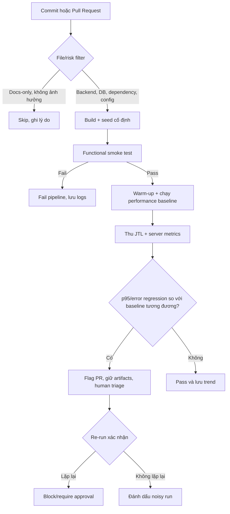

# HW05 – AI-Assisted Performance Testing Report

## Thông tin bài làm

| Trường | Giá trị |
| --- | --- |
| Student ID | 23127104 |
| Họ và tên | Nguyễn Bình Minh Phương |
| Workflow | Workflow 5 – Admin Catalog & Promo Operations |
| SUT | EShop |
| SUT repository | <https://github.com/ttbhanh/eshop-sut> |
| SUT commit được test | Nhánh `main`; chưa lưu commit SHA tại thời điểm chạy |
| Test tool | Apache JMeter 5.6.3 |
| AI tool(s) | OpenAI Codex; Google Antigravity Agent/Gemini (theo lịch sử phiên đã ghi) |
| Ngày thực hiện | 30/08/2026 |
| Public repository | https://github.com/nbmp2005/SoftwareTesting-HW05-23127104 |
| Video demo performance | [YouTube – Video demo HW05](https://youtu.be/6lmRExvkqj4) (6:31) |
| Video demo Agent Skill | [YouTube – Video demo Agent Skill HW05](https://youtu.be/j8wR1m32oiw) (9:09) |

## 1. Tuyên bố sử dụng AI

> I use AI tools for the following tasks.

AI được dùng để phân tích đề, đề xuất/review thiết kế test, hỗ trợ xây Agent Skill, phân tích kết quả JTL và rà soát tài liệu. Mọi output AI được người thực hiện kiểm tra; các log tương tác nằm trong [AI_AUDIT_REPORT.md](AI_AUDIT_REPORT.md). Raw JTL, screenshots, hardware evidence, video, timestamps và kết quả đo không do AI tạo.

## 2. Mục tiêu và phạm vi

Mục tiêu là đánh giá hiệu năng backend EShop bằng Load, Stress, Spike và một short soak test trên cùng workflow quản trị. Ba nhóm endpoint được bao phủ trong một vòng nghiệp vụ:

| Bước | Nhóm | Method và endpoint | Mục đích |
| ---: | --- | --- | --- |
| 1 | Auth-heavy | `POST /api/login` | Đăng nhập admin và lấy JWT |
| 2 | Read-heavy | `GET /api/admin/users` | Đọc danh sách người dùng |
| 3 | Read-heavy | `GET /api/coupons` | Đọc danh sách voucher |
| 4 | Transactional | `POST /api/categories` | Tạo category riêng cho iteration |
| 5 | Transactional | `POST /api/products` hoặc `POST /api/admin/import-products` | Tạo/import sản phẩm thuộc category vừa tạo |
| 6 | Transactional | `POST /api/admin/coupons` | Phát hành voucher có code duy nhất |

Ngoài phạm vi: frontend rendering, mobile app và endpoint không thuộc Workflow 5. Kết quả trên localhost chỉ đại diện cấu hình phần cứng/môi trường đã ghi, không đại diện production.

## 3. Cơ sở đặc tả và source review

Nguồn được dùng:

- [HW05 assignment](../docs/hw05.md).
- [EShop requirements](https://github.com/ttbhanh/eshop-sut/blob/main/README.md).
- [API specification](https://github.com/ttbhanh/eshop-sut/blob/main/api_specification.md).
- [Backend implementation](https://github.com/ttbhanh/eshop-sut/blob/main/backend/server.js).

Source review trước khi thiết kế cho thấy các rủi ro sau:

| Quan sát | Ảnh hưởng đến test | Cách xử lý |
| --- | --- | --- |
| Token được trả ở `$.token` | Request sau phụ thuộc login | Dùng JSON Extractor và Bearer header |
| Category creation trả `id` | Product cần category hợp lệ | Correlate `$.id` sang payload product |
| Coupon code UNIQUE | Rerun/code trùng tạo lỗi 500 giả | Dữ liệu duy nhất theo run/VU/row |
| Import endpoint nhận JSON array do frontend parse CSV | Upload multipart sẽ sai contract thực thi | Gửi `{ "products": [...] }` nếu chọn import |
| `POST /api/products` thiếu auth middleware; nhiều route không check admin role | Lệch FR-12/SEC-03, là lỗi authorization | Gửi token để workflow nhất quán; báo riêng, không gọi là lỗi performance |
| Login sai tăng +2 và khóa 180 s, khác đặc tả +1/30 s | Có thể gây 403 kéo dài và làm hỏng run | Chỉ dùng credential đúng; có runbook recovery |

## 4. Môi trường kiểm thử

### 4.1 Hardware

| Thành phần | Giá trị thực |
| --- | --- |
| Hostname | DESKTOP-J4TEK5A |
| CPU | 12th Gen Intel(R) Core(TM) i5-12500H |
| Cores/threads | 12 cores / 16 threads |
| RAM | 16 GB |
| Storage | NVMe SSD |
| OS/build | Windows 11 Home Single Language 64-bit, build 26200 |
| Network topology | localhost (JMeter và Backend chạy cùng 1 máy) |

Hardware screenshot/report: `evidence/23127104_Hardware_20260830.png`.

### 4.2 Software

| Phần mềm | Version/config thực |
| --- | --- |
| Node.js | v20.x (không có version capture kèm run) |
| npm | 10.x (không có version capture kèm run) |
| JDK | 17 (không có version capture kèm run) |
| JMeter | 5.6.3 (đường dẫn executable hiện trong ảnh run) |
| EShop backend | Nhánh `main`, port 3000; thiếu commit SHA |
| SQLite/database state | Người thực hiện khai báo reset bằng seed trước mỗi scenario; thiếu run notes/server log để cross-check |

### 4.3 Kiểm soát môi trường

Chạy JMeter và Backend (SUT) trên cùng một máy tính. Tắt toàn bộ các ứng dụng ngầm ngốn tài nguyên khi test. Thực hiện chạy 1 lượt Smoke Test ngắn để warm-up hệ thống. Database luôn được tự động hoặc thủ công reset về trạng thái gốc thông qua lệnh seed database của EShop trước mỗi một scenario (Load, Stress, Spike, Soak).

## 5. Thiết kế dữ liệu và correlation

CSV có các nhóm trường: credential; `run_id`/`row_seed`; category; product/import; coupon. Dữ liệu mutation phải duy nhất, UTF-8 và đủ dòng cho số VU khi `Recycle on EOF=false`, `Stop thread on EOF=true`.

Chuỗi correlation:

```text
login response $.token
  -> Authorization: Bearer ${token}
create category response $.id
  -> product.category_id = ${category_id}
```

File CSV thực là `test-data/admin_credentials.csv`, gồm 1 header và 5 dòng credential của môi trường demo. JMX đọc hai cột `credential_email,credential_password`, dùng `Recycle on EOF=true`, `Stop thread on EOF=false`, `Sharing mode=All threads`; `run_id` lấy riêng từ tham số dòng lệnh `-Jrun_id=...`. File đang bị `.gitignore` loại khỏi Git để tránh lộ mật khẩu, vì vậy phải chép thủ công vào ZIP nộp bài hoặc thay bằng một fixture demo an toàn trước khi public.

## 6. Thiết kế chung của JMeter plan

Mỗi plan chứa HTTP Request Defaults, JSON Header Manager, CSV Data Set Config, Thread Group tương ứng, Transaction Controllers, HTTP samplers, JSON Extractors, assertions, timers và JTL writer. Trước full run phải pass smoke test 1 VU × 1 iteration.

Assertions tối thiểu:

- response code đúng với implementation được test;
- login có token không rỗng;
- create operations có ID/message thành công;
- response không chứa lỗi database/auth;
- dependency failure dừng iteration phù hợp.

Full load chạy non-GUI. Listener GUI nặng được disable trong measurement nếu cần; việc này phải được ghi trong run notes.

## 7. Task 1 – Load test

### 7.1 Mục tiêu và cấu hình cuối

| Thuộc tính | Giá trị |
| --- | --- |
| Test plan | `23127104_Load_20260830.jmx` |
| Threads/VUs | 10 VU |
| Ramp-up | 30 giây |
| Steady duration/iterations | Scheduler 330 giây, loop vô hạn trong thời gian đó; khoảng 300 giây sau ramp-up |
| Think time/pacing | Uniform Random Timer 1.000–1.500 ms sau mỗi vòng workflow |
| Listener/report type | Summary Report |
| CSV | `test-data/admin_credentials.csv`; 5 dòng, recycle toàn thread |
| SLO/acceptance criteria | Không có SLO được lưu có provenance trước run; kết quả chỉ được diễn giải mô tả, không hồi tố đặt pass gate |

Baseline AI gợi ý là 20 VU, ramp-up 120 giây và giữ 8 phút. Cấu hình trên chỉ là điểm hiệu chỉnh; bảng phải ghi cấu hình cuối thực sự chạy và lý do thay đổi.

### 7.2 Human review của plan

| AI proposal/omission | Human verdict | Correction và lý do |
| --- | --- | --- |
| Dùng workflow admin với mutation liên tục | Conditional | Bổ sung unique run/VU data để tránh coupon collision |
| Dùng Bearer token sau login | Correct | Trích `$.token`, assert non-empty |
| Không cấu hình Listener nào trong các file JMX (Load, Stress, v.v.) dù đã yêu cầu trong Profile | Incorrect | AI tập trung vào logic tạo tải mà bỏ qua phần trích xuất report. Đã tự add thêm Summary/Aggregate Report vào từng Thread Group. |
| Bỏ sót Response Assertion ở các API quan trọng | Incorrect | AI giả định mọi request đều trả về 200 OK hợp lệ (Happy path). Đã tự thêm Assertion để check response code và chuỗi "Product created". |
| Bỏ quên cơ chế bẫy lỗi Account Lockout (sai 3 lần khóa 180s) | Incorrect | LLM không mô phỏng được trạng thái DB thực tế (Stateful) khi chịu tải. Đã ghi nhận để chú ý khi chạy tải. |
| Đề xuất Include Controller và đường dẫn CSV phụ thuộc vị trí mở file | Conditional | Final JMX nhúng trực tiếp sampler và dùng `test-data/admin_credentials.csv`; lệnh chạy phải được gọi từ repository root. Cách này portable hơn đường dẫn tuyệt đối nhưng cần ghi rõ working directory. |
| Đề xuất Ultimate Thread Group cho Stress/Spike | Incorrect với môi trường chưa có plugin | Final JMX dùng nhiều Thread Group chuẩn với scheduler/delay, nên không cần Custom Thread Groups plugin. |

### 7.3 Execution evidence và kết quả

Nguồn số liệu: raw JTL `results/23127104_Load_20260830.jtl` (406.579 byte; SHA-256 `F98913DC24B504ACE95829CE7B9FFF64CD401512C23782F2FC38FC5CD26211D3`) và JSON `results/23127104_Load_20260830_analysis.json`. Parser: `python -X utf8 agent-skill-kit/hw05-performance-testing/scripts/analyze_jtl.py results/23127104_Load_20260830.jtl --output results/23127104_Load_20260830_analysis.json` (exit code 0). Các JSON path lần lượt là `<label>` và `__overall__`.

| Label | Samples | Failures | Error rate | Throughput (samples/s) | Mean (ms) | Median (ms) | p90 (ms) | p95 (ms) | p99 (ms) | Max (ms) | Response codes |
| --- | ---: | ---: | ---: | ---: | ---: | ---: | ---: | ---: | ---: | ---: | --- |
| `1 - Login admin` | 424 | 0 | 0,0000% | 1,2946 | 3,448 | 3,0 | 5,0 | 6,0 | 10,0 | 102,0 | 200: 424 |
| `2 - GET admin users` | 423 | 0 | 0,0000% | 1,2976 | 2,983 | 3,0 | 4,8 | 6,0 | 10,78 | 16,0 | 200: 423 |
| `3 - GET coupons` | 419 | 0 | 0,0000% | 1,2912 | 5,189 | 5,0 | 7,0 | 9,0 | 18,82 | 34,0 | 200: 419 |
| `4 - POST create category` | 418 | 0 | 0,0000% | 1,2939 | 10,907 | 10,0 | 17,0 | 19,0 | 23,0 | 43,0 | 200: 418 |
| `5 - POST create product` | 417 | 0 | 0,0000% | 1,2935 | 10,770 | 9,0 | 16,0 | 18,0 | 23,0 | 34,0 | 200: 417 |
| `6 - POST create coupon` | 415 | 0 | 0,0000% | 1,2941 | 11,320 | 10,0 | 17,0 | 18,3 | 21,86 | 34,0 | 200: 415 |
| `__overall__` | 2.516 | 0 | 0,0000% | 7,6773 | 7,411 | 7,0 | 14,0 | 17,0 | 21,85 | 102,0 | 200: 2.516 |

`__overall__` có thể dùng cho run này vì JMX không có Transaction Controller/synthetic parent sample; mỗi dòng JTL là một HTTP sampler. Throughput là số sample hoàn tất trên thời gian quan sát, không phải số VU. Cross-check với `results/load-report/statistics.json` cho overall sample count 2.516, error count 0 và p95 17 ms; cả ba absolute delta bằng 0. JMeter HTML và parser có thể lệch nhỏ ở percentile endpoint do khác phương pháp percentile/làm tròn (ví dụ p95 product 18,1 ms so với 18,0 ms).

Kết luận Load: trong cửa sổ quan sát toàn run khoảng 327,719 giây với workload JMX 10 VU, raw JTL ghi nhận 0% lỗi, toàn bộ 2.516 response là HTTP 200, overall p95 17 ms và throughput 7,6773 samples/s. Run này ổn định theo kết quả HTTP/JTL, nhưng chưa đủ để tuyên bố capacity threshold hoặc root cause vì không có nhiều mức tải và chưa có resource trend CPU/RAM/disk đồng bộ theo thời gian.

## 8. Task 1 – Stress test

### 8.1 Mục tiêu và cấu hình cuối

| Thuộc tính | Giá trị |
| --- | --- |
| Test plan | `23127104_Stress_20260830.jmx` |
| Stage/VUs | 10 → 20 → 30 → 40 → 50 VU |
| Duration per stage | Mỗi stage 140 giây: ramp 20 giây + hold khoảng 120 giây |
| Recovery | Không có recovery stage riêng trong JMX đã chạy |
| Listener/report type | Aggregate Report |
| Stop/saturation criteria | Candidate trong audit: error rate >50% trong 5 giây hoặc RAM >90% thì dừng thủ công; không có automated stop controller |

Baseline AI gợi ý các bậc 10→20→40→60 VU, mỗi bậc 2 phút. Phải sửa theo smoke/load baseline và năng lực máy.

Lưu ý provenance: run pre-fix ngày 30/08 thuộc JMX dùng counter cục bộ và chỉ được giữ làm evidence chẩn đoán. Kết quả canonical bên dưới là rerun UUID ngày 03/09, dùng JMX hiện tại với `CPN${run_id}_${__UUID()}` và `run_id=STRESS_UUID_20260903_01`.

### 8.2 Kết quả theo stage

| Stage | Time window | VUs | Throughput | p95 | Error rate | CPU | RAM | Verdict |
| --- | --- | ---: | ---: | ---: | ---: | ---: | ---: | --- |
| 1 | JMX delay 0s, duration 140s | 10 | 7,4394 samples/s | 17 ms | 0% | Không thu metric mới | Không thu metric mới | Stable theo HTTP/JTL |
| 2 | JMX delay 140s, duration 140s | 20 | 14,9190 samples/s | 15 ms | 0% | Không thu metric mới | Không thu metric mới | Stable theo HTTP/JTL |
| 3 | JMX delay 280s, duration 140s | 30 | 22,2335 samples/s | 19 ms | 0% | Không thu metric mới | Không thu metric mới | Stable theo HTTP/JTL |
| 4 | JMX delay 420s, duration 140s | 40 | 29,5590 samples/s | 21 ms | 0% | Không thu metric mới | Không thu metric mới | Stable theo HTTP/JTL |
| 5 | JMX delay 560s, duration 140s | 50 | 36,8904 samples/s | 31 ms | 0% | Không thu metric mới | Không thu metric mới | Mức cao nhất đã test; latency tăng nhưng không có lỗi HTTP |

Nguồn canonical: raw JTL `results/rerun-uuid-20260903/stress/23127104_Stress_UUID_20260903.jtl` (2.851.178 byte; SHA-256 `AA5EFC02BBD57F379D8DB1E0E145646D9079323B134EB2DD059DBA33631DAB97`), parser JSON `results/rerun-uuid-20260903/stress/analysis.json`, HTML report `results/rerun-uuid-20260903/stress/html-report/` và năm JSON tại `stage-analysis/`. Stage được lọc deterministic theo prefix `threadName` rồi chạy parser canonical.

| Label / whole-run JSON path | Samples | Failures | Error rate | Throughput (samples/s) | Mean (ms) | Median (ms) | p90 (ms) | p95 (ms) | p99 (ms) | Max (ms) | Response codes |
| --- | ---: | ---: | ---: | ---: | ---: | ---: | ---: | ---: | ---: | ---: | --- |
| `1 - Login admin` | 2.631 | 0 | 0% | 3,7678 | 3,994 | 2,0 | 8,0 | 12,0 | 24,0 | 506,0 | 200: 2.631 |
| `2 - GET admin users` | 2.603 | 0 | 0% | 3,7380 | 3,420 | 2,0 | 7,0 | 11,0 | 23,0 | 58,0 | 200: 2.603 |
| `3 - GET coupons` | 2.579 | 0 | 0% | 3,7113 | 15,419 | 12,0 | 32,0 | 37,0 | 51,0 | 102,0 | 200: 2.579 |
| `4 - POST create category` | 2.552 | 0 | 0% | 3,6792 | 9,576 | 8,0 | 16,0 | 19,0 | 32,0 | 66,0 | 200: 2.552 |
| `5 - POST create product` | 2.529 | 0 | 0% | 3,6535 | 9,301 | 8,0 | 15,0 | 19,0 | 32,0 | 67,0 | 200: 2.529 |
| `6 - POST create coupon` | 2.503 | 0 | 0% | 3,6229 | 10,056 | 9,0 | 16,0 | 19,0 | 32,98 | 121,0 | 200: 2.503 |
| `__overall__` | 15.397 | 0 | 0% | 22,0486 | 8,593 | 7,0 | 17,0 | 24,0 | 39,0 | 506,0 | 200: 15.397 |

Cross-check với `results/rerun-uuid-20260903/stress/html-report/statistics.json` khớp sample count 15.397, failure count 0 và p95 24 ms (delta 0). Tổng năm stage cũng khớp whole-run. Rerun xác nhận fix UUID: 2.503/2.503 coupon request trả HTTP 200, không còn collision hay HTTP 500.

Không quan sát error-based breakpoint đến mức cao nhất 50 VU. Mức cao nhất đã xác minh theo HTTP/JTL là 50 VU, throughput 36,8904 samples/s, p95 31 ms và 0% lỗi. Đây là **capacity lower bound trong phạm vi đã test**, không phải capacity tối đa tuyệt đối do chưa tăng tải vượt 50 VU và không có resource metric mới theo stage. Pre-fix run ngày 30/08 (15.445 samples, 1.680 lỗi) vẫn được giữ để chứng minh defect và human correction; không dùng làm kết quả performance cuối.

## 9. Task 1 – Spike test

### 9.1 Mục tiêu và cấu hình cuối

| Thuộc tính | Giá trị |
| --- | --- |
| Test plan | `23127104_Spike_20260830.jmx` |
| Baseline VUs/duration | 8 VU, ramp 5 giây, hold khoảng 60 giây (scheduler 65 giây) |
| Spike VUs/rise time/hold | 40 VU, rise 8 giây, hold khoảng 45 giây (delay 65 giây; scheduler 53 giây) |
| Recovery VUs/duration | 8 VU, ramp 5 giây, hold khoảng 60 giây (delay 118 giây; scheduler 65 giây) |
| Listener/report type | View Results Tree cho debug; raw JTL + HTML report từ non-GUI run. Executed JMX để listener enabled; JMX hiện tại đã disable để giảm overhead khi rerun. |
| Recovery criteria | Candidate trong audit: sau burst tối đa 1 phút, error rate 0% và p95 <2.000 ms |

Baseline AI gợi ý 10 VU → 80 VU trong không quá 10 giây, giữ 60 giây → 10 VU trong 2 phút. Cấu hình cuối phải dựa trên Load/Stress thực.

Lưu ý provenance: raw JTL/HTML ngày 30/08 thuộc JMX pre-fix với counter cục bộ và được giữ làm evidence chẩn đoán. Kết quả canonical bên dưới là rerun UUID ngày 03/09 với `run_id=SPIKE_UUID_20260903_01`.

### 9.2 Kết quả theo phase

| Phase | Throughput | p95 | Error rate | CPU/RAM | Observation |
| --- | ---: | ---: | ---: | --- | --- |
| Pre-spike | 6,2253 samples/s | 15 ms | 0% | Không thu metric mới | 393 samples, không lỗi |
| Spike | 29,6644 samples/s | 13 ms | 0% | Không thu metric mới | 1.537 samples, không lỗi trong burst 40 VU |
| Recovery | 6,2506 samples/s | 20 ms | 0% | Không thu metric mới | 400 samples, không lỗi; p95 dưới tiêu chí 2.000 ms |

Phase được tách deterministic theo prefix `threadName` bằng `--thread-prefix`. JSON nằm tại `results/rerun-uuid-20260903/spike/phase-analysis/`; tổng ba phase khớp whole-run 2.330 samples và 0 failures.

Nguồn canonical: raw JTL `results/rerun-uuid-20260903/spike/23127104_Spike_UUID_20260903.jtl` (423.651 byte; SHA-256 `FE98B24EC73AE84E37DD07C23CE7F375DD5745B4FFBB2A078950BB273B9A0D92`), parser JSON `results/rerun-uuid-20260903/spike/analysis.json` và HTML report `results/rerun-uuid-20260903/spike/html-report/`.

| Label / JSON path | Samples | Failures | Error rate | Throughput (samples/s) | Mean (ms) | Median (ms) | p90 (ms) | p95 (ms) | p99 (ms) | Max (ms) | Response codes |
| --- | ---: | ---: | ---: | ---: | ---: | ---: | ---: | ---: | ---: | ---: | --- |
| `1 - Login admin` | 410 | 0 | 0% | 2,2689 | 3,771 | 3,0 | 7,0 | 8,55 | 12,0 | 111,0 | 200: 410 |
| `2 - GET admin users` | 400 | 0 | 0% | 2,2329 | 2,828 | 2,0 | 5,0 | 6,05 | 13,0 | 17,0 | 200: 400 |
| `3 - GET coupons` | 392 | 0 | 0% | 2,2111 | 4,992 | 4,0 | 8,0 | 11,0 | 23,09 | 28,0 | 200: 392 |
| `4 - POST create category` | 388 | 0 | 0% | 2,1890 | 9,222 | 8,0 | 14,0 | 17,65 | 23,13 | 38,0 | 200: 388 |
| `5 - POST create product` | 374 | 0 | 0% | 2,1410 | 8,671 | 8,0 | 13,0 | 16,0 | 22,27 | 33,0 | 200: 374 |
| `6 - POST create coupon` | 366 | 0 | 0% | 2,0994 | 10,407 | 9,0 | 15,0 | 19,0 | 26,35 | 210,0 | 200: 366 |
| `__overall__` | 2.330 | 0 | 0% | 12,8438 | 6,551 | 6,0 | 12,0 | 15,0 | 22,0 | 210,0 | 200: 2.330 |

Cross-check `results/rerun-uuid-20260903/spike/html-report/statistics.json` khớp whole-run sample count 2.330, failure count 0 và p95 15 ms (delta 0). Rerun xác nhận 366/366 coupon request thành công.

Recovery đạt criteria đã khai báo: trong phase recovery 8 VU, error rate trở về 0%, p95 20 ms (thấp hơn 2.000 ms) và throughput 6,2506 samples/s, tương đương pre-spike 6,2253 samples/s. Vì recovery phase bắt đầu ngay sau burst và toàn bộ phase đều đạt tiêu chí, dữ liệu chứng minh hệ thống phục hồi trong cửa sổ quan sát tối đa 1 phút; không có granularity đủ để tuyên bố số giây phục hồi chính xác hơn. Pre-fix run ngày 30/08 được giữ làm evidence của collision và không dùng làm verdict cuối.

## 10. Account lockout và state recovery

Test chính chỉ dùng password đúng. Nếu có 403 do lockout, run bị dừng; response/time được lưu; chờ interval quan sát được hoặc reset database bằng quy trình chính thức; sau đó chạy lại smoke 1 VU. Việc reset làm mất generated data phải được ghi lại.

Không quan sát account lockout trong bốn raw JTL: mọi sampler `1 - Login admin` đều HTTP 200 và không có login failure. Vì vậy không có lần reset lockout thực tế để báo cáo.

## 11. Endurance/soak threshold

| Thuộc tính | Kết quả thực |
| --- | --- |
| Workload và duration (10–15 phút) | 10 VU, ramp 20s, JMX duration 720s; JTL observation 718,670s |
| Stable RPS | Whole-run 7,8395 samples/s; ba cửa sổ: 7,6634 → 7,9255 → 7,9414 samples/s |
| p95 | Whole-run 17 ms; ba cửa sổ đều 17 ms |
| Error rate | Whole-run và cả ba cửa sổ: 0% |
| CPU range/peak | Ảnh duy nhất khoảng phút 4 hiển thị 10%; không đủ xác định range/peak |
| Memory start/peak/end | Ảnh duy nhất hiển thị 12,6/15,7 GB (80%); không đủ xác định start/peak/end hoặc phần riêng của backend |
| Disk/other resource | Ảnh duy nhất hiển thị Disk 7%; không đủ xác định trend |
| Stability criteria | JTL đạt 0% error và không tăng p95 giữa ba cửa sổ; resource stability chưa xác minh |

Nguồn: raw JTL `results/23127104_Soak_20260830.jtl` (1.198.201 byte; SHA-256 `20EAFB9FC9F3C8F8E9752F911E044E876EAF9797BDBEBE2482F5199B4EF61672`) và `results/23127104_Soak_20260830_analysis.json`. Command: `python -X utf8 agent-skill-kit/hw05-performance-testing/scripts/analyze_jtl.py results/23127104_Soak_20260830.jtl --output results/23127104_Soak_20260830_analysis.json` (exit code 0).

| Label / whole-run JSON path | Samples | Failures | Error rate | Throughput (samples/s) | Mean (ms) | Median (ms) | p90 (ms) | p95 (ms) | p99 (ms) | Max (ms) | Response codes |
| --- | ---: | ---: | ---: | ---: | ---: | ---: | ---: | ---: | ---: | ---: | --- |
| `1 - Login admin` | 944 | 0 | 0% | 1,3141 | 3,055 | 3,0 | 4,0 | 6,0 | 12,57 | 74,0 | 200: 944 |
| `2 - GET admin users` | 942 | 0 | 0% | 1,3133 | 2,736 | 2,0 | 4,0 | 5,0 | 12,59 | 24,0 | 200: 942 |
| `3 - GET coupons` | 940 | 0 | 0% | 1,3130 | 8,018 | 6,0 | 14,0 | 20,0 | 32,61 | 63,0 | 200: 940 |
| `4 - POST create category` | 937 | 0 | 0% | 1,3129 | 10,465 | 9,0 | 16,0 | 17,2 | 27,64 | 46,0 | 200: 937 |
| `5 - POST create product` | 936 | 0 | 0% | 1,3137 | 9,847 | 9,0 | 16,0 | 18,0 | 21,65 | 43,0 | 200: 936 |
| `6 - POST create coupon` | 935 | 0 | 0% | 1,3126 | 10,770 | 10,0 | 17,0 | 18,0 | 22,66 | 45,0 | 200: 935 |
| `__overall__` | 5.634 | 0 | 0% | 7,8395 | 7,471 | 7,0 | 15,0 | 17,0 | 26,0 | 74,0 | 200: 5.634 |

Chia deterministic theo timestamp thành ba cửa sổ bằng nhau từ `1788092647918` đến `1788093366588` ms, với boundaries `1788092887474` và `1788093127031` ms. JSON tại `results/soak-window-analysis/window-1_analysis.json` đến `window-3_analysis.json`. Tổng samples/failures ba cửa sổ khớp whole-run: 5.634/0. Cross-check `results/soak-report/statistics.json` cho sample count 5.634, failure count 0 và p95 17 ms; cả ba absolute delta bằng 0.

**Endurance threshold trên hardware này:** chưa xác định đầy đủ. Candidate workload 10 VU duy trì ổn định theo HTTP/JTL trong khoảng 12 phút, nhưng chỉ có một resource screenshot khoảng phút thứ 4, không có resource trend đầu/giữa/cuối và chưa thử mức cao hơn để tìm giới hạn.

Không được suy ra threshold từ thread count đề xuất; kết luận phải dựa trên JTL và resource trend cùng cửa sổ.

## 12. Task 2 – AI analysis và misinterpretation hunt

### 12.1 AI analysis

AI đã phân tích raw JTL Load, Stress, Spike và Soak bằng parser bắt buộc; input/checksum, command và output JSON được ghi tại Mục 7.3, 8.2, 9.2 và 11. AI Audit tương ứng nằm ở Prompt 17–20.

| Claim ID | Exact claim | JSON label/path | Numeric evidence | Type | Confidence | Needed external evidence |
| --- | --- | --- | --- | --- | --- | --- |
| C-LOAD-01 | Load run có 2.516 samples và 0 failures | `__overall__.samples`, `__overall__.failures` | 2.516; 0 | Measured fact | High | None |
| C-LOAD-02 | Overall error rate là 0% và mọi response code là 200 | `__overall__.error_rate_percent`, `__overall__.response_codes` | 0%; 200: 2.516 | Measured fact | High | None |
| C-LOAD-03 | Overall p95 elapsed là 17 ms | `__overall__.elapsed_ms.p95` | 17 ms | Measured fact | High | JMeter HTML dùng để cross-check |
| C-LOAD-04 | Run ổn định theo HTTP/JTL tại workload đã chạy, nhưng chưa chứng minh capacity threshold | `__overall__` | 0% error; p95 17 ms; 7,6773 samples/s | Inference | Medium | Resource trend và các mức tải cao hơn |
| C-SPIKE-01 | UUID rerun có 2.330 samples, 0 failures, error rate 0% và p95 15 ms | `results/rerun-uuid-20260903/spike/analysis.json` → `__overall__` | 2.330; 0; 0%; 15 ms | Measured fact | High | HTML cross-check |
| C-SPIKE-02 | Burst 40 VU có 1.537 samples, 0 lỗi, p95 13 ms | Rerun phase `spike_analysis.json` → `__overall__` | 1.537; 0; 13 ms | Measured fact | High | None |
| C-SPIKE-03 | Recovery đạt candidate criteria | Rerun phase `recovery_analysis.json` → `__overall__` | 400 samples; 0%; p95 20 ms; 6,2506 samples/s | Inference | High | Resource trend nếu cần root cause |
| C-SPIKE-04 | UUID loại bỏ collision của pre-fix run | Coupon label rerun so với pre-fix | 0/366 so với 126/367 failures | Measured comparison | High | None |
| C-STRESS-01 | UUID rerun có 15.397 samples, 0 failures, error rate 0% và p95 24 ms | `results/rerun-uuid-20260903/stress/analysis.json` → `__overall__` | 15.397; 0; 0%; 24 ms | Measured fact | High | HTML cross-check |
| C-STRESS-02 | Cả năm stage đều 0% lỗi | Rerun stage JSON → `__overall__` | 0/0/0/0/0% | Measured fact | High | None |
| C-STRESS-03 | Stage 5 là mức cao nhất đã test | `stage-5_analysis.json` → `__overall__` | 50 VU; 36,8904 samples/s; p95 31 ms; 0% lỗi | Measured fact | High | Resource trend |
| C-STRESS-04 | Không thấy error-based breakpoint đến 50 VU; capacity tuyệt đối chưa xác định | Năm stage rerun + phạm vi workload | 10→50 VU, mọi stage 0% lỗi | Inference | High | Test trên 50 VU + resource trend |
| C-SOAK-01 | Soak whole-run có 5.634 samples, 0 failures và error rate 0% | `results/23127104_Soak_20260830_analysis.json` → `__overall__` | 5.634; 0; 0% | Measured fact | High | None |
| C-SOAK-02 | Overall p95 là 17 ms và throughput 7,8395 samples/s | `__overall__.elapsed_ms.p95`, `.throughput_samples_per_second` | 17 ms; 7,8395 samples/s | Measured fact | High | JMeter HTML cross-check |
| C-SOAK-03 | Ba cửa sổ đều có p95 17 ms và 0 failures | Soak window JSON → `__overall__` | 17/17/17 ms; 0/0/0 failures | Measured fact | High | None |
| C-SOAK-04 | Chưa đủ evidence công bố endurance threshold | Whole/window JSON + thiếu resource trend | 718,670s JTL; một resource screenshot | Inference | High | Resource evidence đầu/giữa/cuối |

### 12.2 Human correction

| AI claim | Giá trị đúng từ raw JTL | Verdict | Giải thích/correction |
| --- | --- | --- | --- |
| C-MIS-001 trong bản nháp AI commit `8897078`: p95 Load 25,5 ms; `GET coupons` max 34 ms là bottleneck | `__overall__.elapsed_ms.p95` 17 ms; `GET coupons.elapsed_ms.p95` 9 ms; max 34 ms | Incorrect | Sai 8,5 ms, tương đối 50%; một max phía client không xác định bottleneck, cần server/resource profiling |
| C-LOAD-01: 2.516 samples, 0 failures | `__overall__`: 2.516 samples, 0 failures | Correct | Khớp `results/load-report/statistics.json`; delta bằng 0 |
| C-LOAD-02: 0% error, tất cả HTTP 200 | `__overall__`: 0%; 200: 2.516 | Correct | Không được diễn giải thành hệ thống không thể có lỗi ngoài phạm vi assertion/JTL |
| C-LOAD-03: p95 overall 17 ms | `__overall__.elapsed_ms.p95`: 17 ms | Correct | Khớp JMeter HTML; delta bằng 0 |
| C-LOAD-04: chưa đủ evidence cho capacity/root cause | Aggregate whole-run only | Correct/incomplete by design | Cần resource trend và nhiều mức tải để mở rộng kết luận |
| Pre-fix Spike: 2.332 samples, 126 failures, 5,4031% error | Pre-fix JSON khớp; UUID rerun: 2.330 samples, 0 failures | Correct cho attempt cũ, superseded cho verdict cuối | Rerun A/B xác nhận lỗi đến từ collision; dùng rerun làm kết quả performance cuối |
| Pre-fix Spike recovery không đạt | Pre-fix: 63/394 failures; rerun: 0/400 failures, p95 20 ms | Superseded | UUID rerun đạt recovery criteria; không còn dùng pre-fix để đánh giá recovery |
| Pre-fix Stress: 15.445 samples, 1.680 failures, 10,8773% error | Pre-fix JSON khớp; UUID rerun: 15.397 samples, 0 failures | Correct cho attempt cũ, superseded cho verdict cuối | Failure pattern là test-data defect, không phải saturation |
| Pre-fix Stress threshold không hợp lệ | Rerun năm stage đều 0% lỗi; Stage 5 p95 31 ms, 36,8904 samples/s | Corrected | Xác nhận lower bound 50 VU; chưa có breakpoint tuyệt đối vì chưa test cao hơn và thiếu resource trend |
| C-SOAK-01: 5.634 samples, 0 failures, 0% error | `__overall__`: cùng giá trị | Correct | Khớp JMeter HTML; sample/failure delta 0 |
| C-SOAK-03: ba cửa sổ có p95 17 ms và 0 failures | Window JSON: cùng giá trị | Correct | Không suy p95 ổn định thành memory ổn định |
| C-SOAK-04: chưa đủ evidence cho endurance threshold | Chỉ một resource screenshot | Correct | Báo rõ CPU/RAM trend và threshold chưa xác định; không nội suy từ một snapshot |

Parser dùng nội suy tuyến tính tại `(n - 1) × percentile / 100`; đối chiếu thứ hai là JMeter HTML `results/load-report/statistics.json`, `results/stress-report/statistics.json`, `results/spike-report/statistics.json` và `results/soak-report/statistics.json`.

Misinterpretation hunt còn phát hiện bản nháp AI trong commit `8897078` đã ghi p95 Load là 25,5 ms và gọi `GET coupons` là bottleneck. Raw JTL/parser cho p95 overall 17 ms (AI cao hơn 8,5 ms, tương đương 50% so với giá trị đúng); `GET coupons` p95 chỉ 9 ms. Max 34 ms của endpoint này cũng không đủ để xác định bottleneck. Correction đúng là chưa thể xác định bottleneck nếu thiếu resource/server profiling. Chi tiết 200–300 từ nằm trong [AI_CRITIQUE.md](AI_CRITIQUE.md).

### 12.3 Optimization feasibility

| AI recommendation | Classification | Evidence | Human judgement |
| --- | --- | --- | --- |
| Database index | Conditional | Cần slow query/query plan và workload read | Không khẳng định lợi ích nếu chưa có evidence |
| SQLite WAL/batching writes | Conditional | Cần dấu hiệu write contention/disk/locking | Có thể phù hợp mutation-heavy workload nhưng phải benchmark A/B |
| Connection pool | Unsupported until verified | Cần xem driver/access pattern | Không tự động phù hợp với SQLite chỉ vì phổ biến ở DB server |
| Coupon code duy nhất xuyên mọi stage | Feasible/verified | Pre-fix có 1.680/126 failures; UUID rerun có 0/0 failures ở Stress/Spike | Fix đã được xác minh bằng A/B rerun; giữ UUID trong JMX |

## 13. Bugs và performance issues

| ID/link | Loại | Summary | Evidence | Trạng thái |
| --- | --- | --- | --- | --- |
| Không ghi nhận trong Load run | Functional/performance | Không có failed sample, HTTP error, crash hoặc latency breach đã khai báo trong raw JTL | `results/23127104_Load_20260830_analysis.json`: `__overall__.failures = 0`, `error_rate_percent = 0`, `response_codes = {"200": 2516}`, p95 = 17 ms | Không tạo bug report/GitHub Issue |
| [BUG-SPIKE-001](https://github.com/nbmp2005/SoftwareTesting-HW05-23127104/issues/1) | Test-data defect; SUT duplicate handling chưa đánh giá | Pre-fix có 126 HTTP 500 do code bị dùng lại | UUID rerun: 2.330 samples, 0 failures; coupon 366/366 HTTP 200 | Fix verified; đóng phần test-script sau khi cập nhật GitHub Issue |
| [BUG-STRESS-001](https://github.com/nbmp2005/SoftwareTesting-HW05-23127104/issues/2) | Test-script/test-data | Counter reset giữa stage tạo 1.680 HTTP 500 giả | UUID rerun: 15.397 samples, 0 failures; cả năm stage 0% lỗi | Fix verified; đóng phần test-script sau khi cập nhật GitHub Issue |
| Không ghi nhận trong Soak run | Functional/performance | Không có failed sample hoặc HTTP error; p95 ba cửa sổ không tăng | Soak JSON: 5.634 samples, 0 failures, p95 17 ms; window p95 17/17/17 ms | Không tạo bug report mới; threshold vẫn thiếu resource trend |

Các sai lệch source đã biết chỉ được tạo Issue sau khi tái hiện trên đúng commit. Không báo một finding source-only như thể đã được quan sát trong performance run.

## 14. Task 3 – Continuous Performance Testing proposal



### 14.1 Quy tắc quyết định

Pipeline chạy performance test khi commit chạm backend route/middleware, database/schema/query, dependency runtime, cấu hình hoặc test workload. Docs-only có thể skip nhưng phải lưu lý do. PR chạy profile ngắn; nightly/release chạy Load/Stress/soak sâu hơn.

Baseline phải versioned và được tạo trong môi trường tương đương. Regression gate nên kết hợp mục tiêu tuyệt đối với thay đổi tương đối, ví dụ `p95 > SLO` hoặc `p95 tăng > X%`, đồng thời kiểm error rate và sample count. `X = 20%` và SLO: `p95 < 25ms` (Dựa trên baseline đo được thực tế là p95 = 17ms, cho phép biên độ dao động hệ thống nhỏ).

### 14.2 Trade-offs

- **Cost**: dedicated runner giảm nhiễu nhưng tăng chi phí; profile ngắn trên PR và sâu vào nightly cân bằng thời gian.
- **False alarms**: shared CPU, warm-up, garbage collection, antivirus và background I/O làm p95 dao động; dùng warm-up, lặp lại và môi trường cố định.
- **False negatives**: filter commit có thể skip thay đổi gián tiếp; dependency/config/schema luôn nên kích hoạt.
- **Baseline drift**: không tự động chấp nhận baseline xấu; thay baseline cần review và liên kết lý do.
- **Statistical confidence**: ít mẫu khiến p95/p99 bất ổn; gate cần minimum sample count.
- **Triage**: pipeline chỉ flag regression, không tự tuyên bố root cause.

## 15. AI Critique

Xem [AI_CRITIQUE.md](AI_CRITIQUE.md). Bản critique dùng claim sai có thật trong bản nháp AI ở commit `8897078`, đối chiếu lại với raw JTL, JSON canonical và JMeter HTML report.

## 16. Demo video

Hai video đã được upload lên YouTube:

- **Video 1 – Performance testing:** [https://youtu.be/6lmRExvkqj4](https://youtu.be/6lmRExvkqj4), thời lượng metadata 391 giây (6:31). Video trình bày performance testing, resource monitor, kết quả và human correction.
- **Video 2 – Agent Skill:** [https://youtu.be/j8wR1m32oiw](https://youtu.be/j8wR1m32oiw), thời lượng metadata 549–550 giây (khoảng 9:09). Video demo Agent Skill end-to-end.

Hai URL và metadata tiêu đề/thời lượng được xác minh trực tiếp qua YouTube ngày 03/09/2026. Trạng thái privacy **Unlisted**, lời thuyết minh tiếng Việt và mức độ hiển thị tool/resource monitor cần người nộp mở lại bằng cửa sổ ẩn danh để kiểm tra thủ công trước khi đóng ZIP. Kịch bản gốc: [video performance](../docs/05_KICH_BAN_VIDEO_DEMO.md) và [video Agent Skill](../docs/06_KICH_BAN_VIDEO_AGENT_SKILL.md).

## 17. Human review tổng kết

| Nội dung AI hỗ trợ | Điều người thực hiện xác minh/sửa | Bằng chứng |
| --- | --- | --- |
| Endpoint/workflow mapping | Đối chiếu API spec và backend source | Source links ở mục 3 |
| Workload seed | Giảm từ proposal 100/200 VU xuống cấu hình final trong JMX dựa trên smoke/run khả thi | JMX Load/Stress/Spike và AI Audit Prompt 11–12 |
| JTL metrics | Chạy parser canonical, thêm phase filter và cross-check sample/failure/p95 với HTML | JSON analysis, HTML `statistics.json`, parser tests 4/4 |
| Optimization | Chỉ xác nhận sửa coupon uniqueness; index/WAL/pool giữ conditional vì thiếu profiling | Mục 12.3 và BUG-STRESS-001 |
| Documentation | Đồng bộ filename/config/evidence, phục hồi `SKILL.md`, tách rõ artefact có thật và blocker | README, artifact index, submission checklist |

## 18. Kết luận và giới hạn

Load run tại 10 VU ghi nhận 2.516 samples, 0% lỗi, p95 17 ms và 7,6773 samples/s. Soak 10 VU trong khoảng 12 phút cũng có 0% lỗi, p95 17 ms và throughput ổn định qua ba cửa sổ; tuy nhiên chưa thể gọi đây là endurance threshold tuyệt đối vì chỉ có một resource snapshot và chưa thử nhiều mức tải. UUID rerun đã khắc phục defect của Stress/Spike: Stress có 15.397 samples, 0 lỗi, p95 24 ms; cả năm stage đều 0% lỗi và Stage 5 tại 50 VU đạt 36,8904 samples/s, p95 31 ms. Spike có 2.330 samples, 0 lỗi, p95 15 ms; burst và recovery đều không lỗi, recovery p95 20 ms và throughput trở về mức pre-spike.

Không có evidence đủ để tuyên bố bottleneck backend. Latency phía client thấp không thay thế CPU/RAM/disk trend, server log hay profiler. Bài học human review chính là mọi claim AI phải truy ngược về raw JTL/JSON và cấu hình JMX; một error rate cao có thể do test script chứ không phải saturation.

Giới hạn: SUT và load generator chạy cùng máy qua localhost; resource screenshot cũ chỉ là snapshot, không phải time series; rerun UUID không bổ sung ảnh/resource metric mới; soak ngắn; SQLite và dữ liệu mutation tăng dần; background processes không được định lượng; SUT commit SHA và run notes/server log chưa được lưu. Stress chỉ test đến 50 VU, nên 50 VU là lower bound đã xác minh chứ không phải capacity tối đa tuyệt đối.

## Phụ lục A – Artifact index

| Artifact | Đường dẫn/link thực | Trạng thái |
| --- | --- | --- |
| Load JMX/CSV/JTL/HTML | `jmeter/23127104_Load_20260830.jmx`, `test-data/admin_credentials.csv`, `results/23127104_Load_20260830.jtl`, `results/load-report/` | Đã có |
| Stress JMX/CSV/JTL/HTML | `jmeter/23127104_Stress_20260830.jmx`, `test-data/admin_credentials.csv`, `results/rerun-uuid-20260903/stress/` | UUID rerun canonical đã có; pre-fix JTL/report vẫn giữ riêng làm diagnostic evidence |
| Spike JMX/CSV/JTL/HTML | `jmeter/23127104_Spike_20260830.jmx`, `test-data/admin_credentials.csv`, `results/rerun-uuid-20260903/spike/` | UUID rerun canonical đã có; pre-fix JTL/report vẫn giữ riêng làm diagnostic evidence |
| Soak JTL/report | `jmeter/23127104_Soak_20260830.jmx`, `test-data/admin_credentials.csv`, `results/23127104_Soak_20260830.jtl`, `results/soak-report/` | Đã có |
| Hardware/resource screenshots | `evidence/23127104_Hardware_20260830.png`, `evidence/23127104_Load_Evidence_20260830.png`, `evidence/23127104_Stress_Evidence_20260830.png`, `evidence/23127104_Spike_Evidence_20260830.png`, `evidence/23127104_Soak_Evidence_20260830.png` | Đã có |
| Server logs/run notes | Không có trong repository | Thiếu; giới hạn root-cause analysis |
| Bug report / GitHub Issues | `report/BUG_REPORT.md` ([BUG-SPIKE-001](https://github.com/nbmp2005/SoftwareTesting-HW05-23127104/issues/1), [BUG-STRESS-001](https://github.com/nbmp2005/SoftwareTesting-HW05-23127104/issues/2)) | Local reports đã có; đã gắn GitHub Issue link |
| Demo performance / Agent Skill | [Video performance](https://youtu.be/6lmRExvkqj4), [video Agent Skill](https://youtu.be/j8wR1m32oiw) | URL và thời lượng đã xác minh; privacy/nội dung cần human review cuối |
| Git commit log text | `report/GIT_COMMIT_LOG.txt` | Có snapshot đến commit `37622e0`; phải export lại sau commit cuối |

## Phụ lục B – AI Audit Report

Xem [AI_AUDIT_REPORT.md](AI_AUDIT_REPORT.md).
