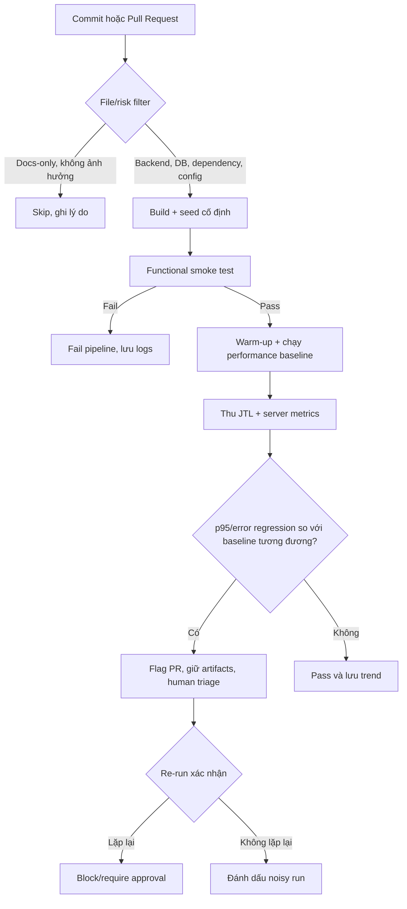

# HW05 – AI-Assisted Performance Testing Report

## Thông tin bài làm

| Trường | Giá trị |
| --- | --- |
| Student ID | 23127104 |
| Họ và tên | `TODO (STUDENT INPUT REQUIRED)` |
| Workflow | Workflow 5 – Admin Catalog & Promo Operations |
| SUT | EShop |
| SUT repository | <https://github.com/ttbhanh/eshop-sut> |
| SUT commit được test | `TODO (REAL COMMIT SHA REQUIRED)` |
| Test tool | Apache JMeter `TODO (REAL VERSION REQUIRED)` |
| AI tool(s) | OpenAI Codex; `TODO (DECLARE ALL OTHER REAL AI TOOLS)` |
| Ngày thực hiện | `TODO (REAL EXECUTION DATES REQUIRED)` |
| Public repository | `TODO (REAL URL REQUIRED)` |
| Demo video | `TODO (REAL UNLISTED YOUTUBE URL REQUIRED)` |

## 1. Tuyên bố sử dụng AI

> I use AI tools for the following tasks.

AI được dùng để phân tích đề, đề xuất/review thiết kế test, hỗ trợ xây Agent Skill, phân tích kết quả JTL và rà soát tài liệu. Mọi output AI được người thực hiện kiểm tra; các log tương tác nằm trong [AI_AUDIT_REPORT.md](AI_AUDIT_REPORT.md). Raw JTL, screenshots, hardware evidence, video, timestamps và kết quả đo không do AI tạo.

## 2. Mục tiêu và phạm vi

Mục tiêu là đánh giá hiệu năng backend EShop bằng Load, Stress, Spike và một short soak test trên cùng workflow quản trị. Ba nhóm endpoint được bao phủ trong một vòng nghiệp vụ:

| Bước | Nhóm | Method và endpoint | Mục đích |
| ---: | --- | --- | --- |
| 1 | Auth-heavy | `POST /api/login` | Đăng nhập admin và lấy JWT |
| 2 | Read-heavy | `GET /api/admin/users` | Đọc danh sách người dùng |
| 3 | Read-heavy | `GET /api/coupons` | Đọc danh sách voucher |
| 4 | Transactional | `POST /api/categories` | Tạo category riêng cho iteration |
| 5 | Transactional | `POST /api/products` hoặc `POST /api/admin/import-products` | Tạo/import sản phẩm thuộc category vừa tạo |
| 6 | Transactional | `POST /api/admin/coupons` | Phát hành voucher có code duy nhất |

Ngoài phạm vi: frontend rendering, mobile app và endpoint không thuộc Workflow 5. Kết quả trên localhost chỉ đại diện cấu hình phần cứng/môi trường đã ghi, không đại diện production.

## 3. Cơ sở đặc tả và source review

Nguồn được dùng:

- [HW05 assignment](../docs/hw05.md).
- [EShop requirements](https://github.com/ttbhanh/eshop-sut/blob/main/README.md).
- [API specification](https://github.com/ttbhanh/eshop-sut/blob/main/api_specification.md).
- [Backend implementation](https://github.com/ttbhanh/eshop-sut/blob/main/backend/server.js).

Source review trước khi thiết kế cho thấy các rủi ro sau:

| Quan sát | Ảnh hưởng đến test | Cách xử lý |
| --- | --- | --- |
| Token được trả ở `$.token` | Request sau phụ thuộc login | Dùng JSON Extractor và Bearer header |
| Category creation trả `id` | Product cần category hợp lệ | Correlate `$.id` sang payload product |
| Coupon code UNIQUE | Rerun/code trùng tạo lỗi 500 giả | Dữ liệu duy nhất theo run/VU/row |
| Import endpoint nhận JSON array do frontend parse CSV | Upload multipart sẽ sai contract thực thi | Gửi `{ "products": [...] }` nếu chọn import |
| `POST /api/products` thiếu auth middleware; nhiều route không check admin role | Lệch FR-12/SEC-03, là lỗi authorization | Gửi token để workflow nhất quán; báo riêng, không gọi là lỗi performance |
| Login sai tăng +2 và khóa 180 s, khác đặc tả +1/30 s | Có thể gây 403 kéo dài và làm hỏng run | Chỉ dùng credential đúng; có runbook recovery |

## 4. Môi trường kiểm thử

### 4.1 Hardware

| Thành phần | Giá trị thực |
| --- | --- |
| Hostname | `TODO (REAL HARDWARE EVIDENCE REQUIRED)` |
| CPU | TODO |
| Cores/threads | TODO |
| RAM | TODO |
| Storage | TODO |
| OS/build | TODO |
| Network topology | `TODO (localhost/LAN + details)` |

Hardware screenshot/report: `TODO (REAL PATH/LINK REQUIRED)`.

### 4.2 Software

| Phần mềm | Version/config thực |
| --- | --- |
| Node.js | TODO |
| npm | TODO |
| JDK | TODO |
| JMeter | TODO |
| EShop backend | commit TODO, port 3000 |
| SQLite/database state | TODO |

### 4.3 Kiểm soát môi trường

`TODO (REAL DESCRIPTION REQUIRED: processes closed, warm-up, same machine or separate load generator, clock/timezone, database reset policy)`.

## 5. Thiết kế dữ liệu và correlation

CSV có các nhóm trường: credential; `run_id`/`row_seed`; category; product/import; coupon. Dữ liệu mutation phải duy nhất, UTF-8 và đủ dòng cho số VU khi `Recycle on EOF=false`, `Stop thread on EOF=true`.

Chuỗi correlation:

```text
login response $.token
  -> Authorization: Bearer ${token}
create category response $.id
  -> product.category_id = ${category_id}
```

Credential production không được commit. File CSV thực và số dòng: `TODO (REAL FILES/COUNTS REQUIRED)`.

## 6. Thiết kế chung của JMeter plan

Mỗi plan chứa HTTP Request Defaults, JSON Header Manager, CSV Data Set Config, Thread Group tương ứng, Transaction Controllers, HTTP samplers, JSON Extractors, assertions, timers và JTL writer. Trước full run phải pass smoke test 1 VU × 1 iteration.

Assertions tối thiểu:

- response code đúng với implementation được test;
- login có token không rỗng;
- create operations có ID/message thành công;
- response không chứa lỗi database/auth;
- dependency failure dừng iteration phù hợp.

Full load chạy non-GUI. Listener GUI nặng được disable trong measurement nếu cần; việc này phải được ghi trong run notes.

## 7. Task 1 – Load test

### 7.1 Mục tiêu và cấu hình cuối

| Thuộc tính | Giá trị |
| --- | --- |
| Test plan | `23127104_Load_TODO-REALDATE.jmx` |
| Threads/VUs | `TODO (REAL FINAL CONFIG)` |
| Ramp-up | TODO |
| Steady duration/iterations | TODO |
| Think time/pacing | TODO |
| Listener/report type | Summary Report |
| CSV | TODO |
| SLO/acceptance criteria | `TODO (DECLARED BEFORE RUN)` |

Baseline AI gợi ý là 20 VU, ramp-up 120 giây và giữ 8 phút. Cấu hình trên chỉ là điểm hiệu chỉnh; bảng phải ghi cấu hình cuối thực sự chạy và lý do thay đổi.

### 7.2 Human review của plan

| AI proposal/omission | Human verdict | Correction và lý do |
| --- | --- | --- |
| Dùng workflow admin với mutation liên tục | Conditional | Bổ sung unique run/VU data để tránh coupon collision |
| Dùng Bearer token sau login | Correct | Trích `$.token`, assert non-empty |
| Không cấu hình Listener nào trong các file JMX (Load, Stress, v.v.) dù đã yêu cầu trong Profile | Incorrect | AI tập trung vào logic tạo tải mà bỏ qua phần trích xuất report. Đã tự add thêm Summary/Aggregate Report vào từng Thread Group. |
| Bỏ sót Response Assertion ở các API quan trọng | Incorrect | AI giả định mọi request đều trả về 200 OK hợp lệ (Happy path). Đã tự thêm Assertion để check response code và chuỗi "Product created". |
| Bỏ quên cơ chế bẫy lỗi Account Lockout (sai 3 lần khóa 180s) | Incorrect | LLM không mô phỏng được trạng thái DB thực tế (Stateful) khi chịu tải. Đã ghi nhận để chú ý khi chạy tải. |
| Sử dụng Include Controller với đường dẫn CSV tương đối `../test-data/admin_credentials.csv` | Conditional | Rất dễ gây lỗi File Not Found khi mở bằng JMeter GUI ở thư mục khác. Đã sửa lại thành đường dẫn tuyệt đối tới file CSV. |
| Sử dụng UltimateThreadGroup cho Stress/Spike test mà không báo trước | Incorrect | File JMX sẽ bị lỗi khi mở nếu JMeter chưa cài Custom Thread Groups plugin. Cần cài đặt plugin qua JMeter Plugins Manager để chạy được kịch bản Stress và Spike. |

### 7.3 Execution evidence và kết quả

Nguồn số liệu: raw JTL `results/23127104_Load_20260830.jtl` (406.579 byte; SHA-256 `F98913DC24B504ACE95829CE7B9FFF64CD401512C23782F2FC38FC5CD26211D3`) và JSON `results/23127104_Load_20260830_analysis.json`. Parser: `python -X utf8 agent-skill-kit/hw05-performance-testing/scripts/analyze_jtl.py results/23127104_Load_20260830.jtl --output results/23127104_Load_20260830_analysis.json` (exit code 0). Các JSON path lần lượt là `<label>` và `__overall__`.

| Label | Samples | Failures | Error rate | Throughput (samples/s) | Mean (ms) | Median (ms) | p90 (ms) | p95 (ms) | p99 (ms) | Max (ms) | Response codes |
| --- | ---: | ---: | ---: | ---: | ---: | ---: | ---: | ---: | ---: | ---: | --- |
| `1 - Login admin` | 424 | 0 | 0,0000% | 1,2946 | 3,448 | 3,0 | 5,0 | 6,0 | 10,0 | 102,0 | 200: 424 |
| `2 - GET admin users` | 423 | 0 | 0,0000% | 1,2976 | 2,983 | 3,0 | 4,8 | 6,0 | 10,78 | 16,0 | 200: 423 |
| `3 - GET coupons` | 419 | 0 | 0,0000% | 1,2912 | 5,189 | 5,0 | 7,0 | 9,0 | 18,82 | 34,0 | 200: 419 |
| `4 - POST create category` | 418 | 0 | 0,0000% | 1,2939 | 10,907 | 10,0 | 17,0 | 19,0 | 23,0 | 43,0 | 200: 418 |
| `5 - POST create product` | 417 | 0 | 0,0000% | 1,2935 | 10,770 | 9,0 | 16,0 | 18,0 | 23,0 | 34,0 | 200: 417 |
| `6 - POST create coupon` | 415 | 0 | 0,0000% | 1,2941 | 11,320 | 10,0 | 17,0 | 18,3 | 21,86 | 34,0 | 200: 415 |
| `__overall__` | 2.516 | 0 | 0,0000% | 7,6773 | 7,411 | 7,0 | 14,0 | 17,0 | 21,85 | 102,0 | 200: 2.516 |

`__overall__` có thể dùng cho run này vì JMX không có Transaction Controller/synthetic parent sample; mỗi dòng JTL là một HTTP sampler. Throughput là số sample hoàn tất trên thời gian quan sát, không phải số VU. Cross-check với `results/load-report/statistics.json` cho overall sample count 2.516, error count 0 và p95 17 ms; cả ba absolute delta bằng 0. JMeter HTML và parser có thể lệch nhỏ ở percentile endpoint do khác phương pháp percentile/làm tròn (ví dụ p95 product 18,1 ms so với 18,0 ms).

Kết luận Load: trong cửa sổ quan sát toàn run khoảng 327,719 giây với workload JMX 10 VU, raw JTL ghi nhận 0% lỗi, toàn bộ 2.516 response là HTTP 200, overall p95 17 ms và throughput 7,6773 samples/s. Run này ổn định theo kết quả HTTP/JTL, nhưng chưa đủ để tuyên bố capacity threshold hoặc root cause vì không có nhiều mức tải và chưa có resource trend CPU/RAM/disk đồng bộ theo thời gian.

## 8. Task 1 – Stress test

### 8.1 Mục tiêu và cấu hình cuối

| Thuộc tính | Giá trị |
| --- | --- |
| Test plan | `23127104_Stress_TODO-REALDATE.jmx` |
| Stage/VUs | `TODO (REAL FINAL STAGES)` |
| Duration per stage | TODO |
| Recovery | TODO |
| Listener/report type | Aggregate Report |
| Stop/saturation criteria | TODO |

Baseline AI gợi ý các bậc 10→20→40→60 VU, mỗi bậc 2 phút. Phải sửa theo smoke/load baseline và năng lực máy.

### 8.2 Kết quả theo stage

| Stage | Time window | VUs | Throughput | p95 | Error rate | CPU | RAM | Verdict |
| --- | --- | ---: | ---: | ---: | ---: | ---: | ---: | --- |
| 1 | JMX delay 0s, duration 140s | 10 | 7,4455 samples/s | 16 ms | 0% | TODO | TODO | Stable theo HTTP/JTL tại stage này |
| 2 | JMX delay 140s, duration 140s | 20 | 14,8748 samples/s | 13 ms | 8,0911% | TODO | TODO | Invalid: coupon collision bắt đầu |
| 3 | JMX delay 280s, duration 140s | 30 | 22,2763 samples/s | 10 ms | 10,9314% | TODO | TODO | Invalid: coupon collision |
| 4 | JMX delay 420s, duration 140s | 40 | 29,7158 samples/s | 10 ms | 12,2271% | TODO | TODO | Invalid: coupon collision |
| 5 | JMX delay 560s, duration 140s | 50 | 37,0694 samples/s | 16 ms | 13,0596% | TODO | TODO | Invalid: coupon collision |

Nguồn whole-run: raw JTL `results/23127104_Stress_20260830.jtl` (3.058.854 byte; SHA-256 `DF6EC49CCCEB4DBBF3AE6F9E0B6981B9EE27B2C3C5FE0AF7A4DF46567E4898DA`) và `results/23127104_Stress_20260830_analysis.json`. Stage JSON tại `results/stress-stage-analysis/stage-1_analysis.json` đến `stage-5_analysis.json`, tạo bằng cách tách deterministic theo prefix `threadName` rồi chạy lại parser canonical.

| Label / whole-run JSON path | Samples | Failures | Error rate | Throughput (samples/s) | Mean (ms) | Median (ms) | p90 (ms) | p95 (ms) | p99 (ms) | Max (ms) | Response codes |
| --- | ---: | ---: | ---: | ---: | ---: | ---: | ---: | ---: | ---: | ---: | --- |
| `1 - Login admin` | 2.642 | 0 | 0% | 3,7838 | 3,136 | 2,0 | 5,0 | 8,0 | 15,0 | 80,0 | 200: 2.642 |
| `2 - GET admin users` | 2.608 | 0 | 0% | 3,7426 | 2,807 | 2,0 | 4,0 | 7,65 | 15,0 | 43,0 | 200: 2.608 |
| `3 - GET coupons` | 2.579 | 0 | 0% | 3,7083 | 7,177 | 6,0 | 13,0 | 16,0 | 29,0 | 47,0 | 200: 2.579 |
| `4 - POST create category` | 2.559 | 0 | 0% | 3,6851 | 8,138 | 7,0 | 12,0 | 15,0 | 19,42 | 45,0 | 200: 2.559 |
| `5 - POST create product` | 2.538 | 0 | 0% | 3,6618 | 8,095 | 7,0 | 13,0 | 16,0 | 22,0 | 45,0 | 200: 2.538 |
| `6 - POST create coupon` | 2.519 | 1.680 | 66,6931% | 3,6394 | 4,787 | 3,0 | 10,0 | 12,0 | 17,0 | 45,0 | 200: 839; 500: 1.680 |
| `__overall__` | 15.445 | 1.680 | 10,8773% | 22,1151 | 5,668 | 5,0 | 10,0 | 14,0 | 21,0 | 80,0 | 200: 13.765; 500: 1.680 |

Cross-check `results/stress-report/statistics.json`: overall sample count 15.445, failure count 1.680 và p95 14 ms đều có absolute delta 0. Tổng năm stage JSON cũng khớp whole-run ở samples và failures.

First sustained breach: Stage 2 ở 20 VU có error rate 8,0911%, nhưng breach này do coupon data collision, không phải capacity breach đã xác nhận.

Highest stable stage trong run hiện tại theo HTTP/JTL là Stage 1 (10 VU, 0% error, p95 16 ms). Không công bố đây là Stress capacity threshold vì Stage 2–5 bị test-data defect và thiếu resource trend theo stage.

Failure mode: toàn bộ 1.680 failures là HTTP 500 ở `POST create coupon`. Số coupon failures Stage 2–5 lần lượt 167, 338, 504, 671, đúng bằng coupon samples của stage ngay trước; cùng biểu thức code bị dùng lại trong mỗi Thread Group, đây là bằng chứng định lượng mạnh cho counter/data collision. Stress plan không có recovery stage riêng. Xem [BUG-STRESS-001](BUG_REPORT.md#bug-stress-001--coupon-code-bị-tái-sử-dụng-giữa-các-stress-stage-tạo-http-500-giả-capacity-failure).

## 9. Task 1 – Spike test

### 9.1 Mục tiêu và cấu hình cuối

| Thuộc tính | Giá trị |
| --- | --- |
| Test plan | `23127104_Spike_TODO-REALDATE.jmx` |
| Baseline VUs/duration | TODO |
| Spike VUs/rise time/hold | TODO |
| Recovery VUs/duration | TODO |
| Listener/report type | View Results Tree cho debug; `TODO (REAL FULL-RUN OUTPUT)` |
| Recovery criteria | TODO |

Baseline AI gợi ý 10 VU → 80 VU trong không quá 10 giây, giữ 60 giây → 10 VU trong 2 phút. Cấu hình cuối phải dựa trên Load/Stress thực.

### 9.2 Kết quả theo phase

| Phase | Throughput | p95 | Error rate | CPU/RAM | Observation |
| --- | ---: | ---: | ---: | --- | --- |
| Pre-spike | TODO (REAL STAGE-WINDOW ANALYSIS REQUIRED) | TODO | TODO | TODO | Chưa có JSON chia cửa sổ phase |
| Spike | TODO (REAL STAGE-WINDOW ANALYSIS REQUIRED) | TODO | TODO | TODO | Chưa có JSON chia cửa sổ phase |
| Recovery | TODO (REAL STAGE-WINDOW ANALYSIS REQUIRED) | TODO | TODO | TODO | Raw failed rows có thread name recovery, nhưng chưa định lượng phase bằng parser |

Nguồn aggregate whole-run: raw JTL `results/23127104_Spike_20260830.jtl` (439.607 byte; SHA-256 `0DCF49DEDEF899ED570B545543F483535023DAEC89A23FE3127A8A2C1B7B3A23`) và parser JSON `results/23127104_Spike_20260830_analysis.json`. Command: `python -X utf8 agent-skill-kit/hw05-performance-testing/scripts/analyze_jtl.py results/23127104_Spike_20260830.jtl --output results/23127104_Spike_20260830_analysis.json` (exit code 0).

| Label / JSON path | Samples | Failures | Error rate | Throughput (samples/s) | Mean (ms) | Median (ms) | p90 (ms) | p95 (ms) | p99 (ms) | Max (ms) | Response codes |
| --- | ---: | ---: | ---: | ---: | ---: | ---: | ---: | ---: | ---: | ---: | --- |
| `1 - Login admin` | 416 | 0 | 0% | 2,2965 | 4,337 | 3,0 | 7,0 | 9,0 | 20,0 | 110,0 | 200: 416 |
| `2 - GET admin users` | 400 | 0 | 0% | 2,2311 | 3,208 | 3,0 | 6,0 | 7,05 | 15,01 | 19,0 | 200: 400 |
| `3 - GET coupons` | 391 | 0 | 0% | 2,2024 | 4,698 | 4,0 | 7,0 | 10,0 | 15,3 | 39,0 | 200: 391 |
| `4 - POST create category` | 383 | 0 | 0% | 2,1856 | 10,540 | 10,0 | 16,0 | 17,0 | 21,36 | 28,0 | 200: 383 |
| `5 - POST create product` | 375 | 0 | 0% | 2,1414 | 10,872 | 10,0 | 17,0 | 19,3 | 23,52 | 29,0 | 200: 375 |
| `6 - POST create coupon` | 367 | 126 | 34,3324% | 2,1146 | 8,580 | 9,0 | 15,0 | 17,0 | 20,68 | 39,0 | 200: 241; 500: 126 |
| `__overall__` | 2.332 | 126 | 5,4031% | 12,8737 | 6,941 | 6,0 | 13,0 | 16,0 | 21,69 | 110,0 | 200: 2.206; 500: 126 |

Cross-check `results/spike-report/statistics.json` cho overall sample count 2.332, failure count 126 và p95 16 ms; cả ba delta bằng 0. `__overall__` không double-count vì JMX không có Transaction Controller parent sample, nhưng chỉ đại diện whole-run aggregate và không dùng để so pre-spike/spike/recovery.

Recovery time và kết luận: run thất bại về reliability do overall error rate 5,4031%, tập trung hoàn toàn ở `POST create coupon`. Không được kết luận SUT quá tải hoặc đã recovery từ aggregate JSON; cần stage-window parser và server log. Xem [BUG-SPIKE-001](BUG_REPORT.md#bug-spike-001--post-create-coupon-trả-http-500-trong-spike-run).

## 10. Account lockout và state recovery

Test chính chỉ dùng password đúng. Nếu có 403 do lockout, run bị dừng; response/time được lưu; chờ interval quan sát được hoặc reset database bằng quy trình chính thức; sau đó chạy lại smoke 1 VU. Việc reset làm mất generated data phải được ghi lại.

Lần recovery thực tế (nếu có): `TODO (REAL STEPS/EVIDENCE OR STATE "NOT TRIGGERED")`.

## 11. Endurance/soak threshold

| Thuộc tính | Kết quả thực |
| --- | --- |
| Workload và duration (10–15 phút) | 10 VU, ramp 20s, JMX duration 720s; JTL observation 718,670s |
| Stable RPS | Whole-run 7,8395 samples/s; ba cửa sổ: 7,6634 → 7,9255 → 7,9414 samples/s |
| p95 | Whole-run 17 ms; ba cửa sổ đều 17 ms |
| Error rate | Whole-run và cả ba cửa sổ: 0% |
| CPU range/peak | TODO (REAL START/MID/END RESOURCE EVIDENCE REQUIRED) |
| Memory start/peak/end | TODO (REAL START/MID/END RESOURCE EVIDENCE REQUIRED) |
| Disk/other resource | TODO (REAL START/MID/END RESOURCE EVIDENCE REQUIRED) |
| Stability criteria | JTL đạt 0% error và không tăng p95 giữa ba cửa sổ; resource stability chưa xác minh |

Nguồn: raw JTL `results/23127104_Soak_20260830.jtl` (1.198.201 byte; SHA-256 `20EAFB9FC9F3C8F8E9752F911E044E876EAF9797BDBEBE2482F5199B4EF61672`) và `results/23127104_Soak_20260830_analysis.json`. Command: `python -X utf8 agent-skill-kit/hw05-performance-testing/scripts/analyze_jtl.py results/23127104_Soak_20260830.jtl --output results/23127104_Soak_20260830_analysis.json` (exit code 0).

| Label / whole-run JSON path | Samples | Failures | Error rate | Throughput (samples/s) | Mean (ms) | Median (ms) | p90 (ms) | p95 (ms) | p99 (ms) | Max (ms) | Response codes |
| --- | ---: | ---: | ---: | ---: | ---: | ---: | ---: | ---: | ---: | ---: | --- |
| `1 - Login admin` | 944 | 0 | 0% | 1,3141 | 3,055 | 3,0 | 4,0 | 6,0 | 12,57 | 74,0 | 200: 944 |
| `2 - GET admin users` | 942 | 0 | 0% | 1,3133 | 2,736 | 2,0 | 4,0 | 5,0 | 12,59 | 24,0 | 200: 942 |
| `3 - GET coupons` | 940 | 0 | 0% | 1,3130 | 8,018 | 6,0 | 14,0 | 20,0 | 32,61 | 63,0 | 200: 940 |
| `4 - POST create category` | 937 | 0 | 0% | 1,3129 | 10,465 | 9,0 | 16,0 | 17,2 | 27,64 | 46,0 | 200: 937 |
| `5 - POST create product` | 936 | 0 | 0% | 1,3137 | 9,847 | 9,0 | 16,0 | 18,0 | 21,65 | 43,0 | 200: 936 |
| `6 - POST create coupon` | 935 | 0 | 0% | 1,3126 | 10,770 | 10,0 | 17,0 | 18,0 | 22,66 | 45,0 | 200: 935 |
| `__overall__` | 5.634 | 0 | 0% | 7,8395 | 7,471 | 7,0 | 15,0 | 17,0 | 26,0 | 74,0 | 200: 5.634 |

Chia deterministic theo timestamp thành ba cửa sổ bằng nhau từ `1788092647918` đến `1788093366588` ms, với boundaries `1788092887474` và `1788093127031` ms. JSON tại `results/soak-window-analysis/window-1_analysis.json` đến `window-3_analysis.json`. Tổng samples/failures ba cửa sổ khớp whole-run: 5.634/0. Cross-check `results/soak-report/statistics.json` cho sample count 5.634, failure count 0 và p95 17 ms; cả ba absolute delta bằng 0.

**Endurance threshold trên hardware này:** `TODO (REAL START/MID/END RESOURCE EVIDENCE REQUIRED)`. Candidate workload 10 VU duy trì ổn định theo HTTP/JTL trong khoảng 12 phút, nhưng chưa đủ điều kiện gọi là measured endurance threshold vì chỉ có một resource screenshot khoảng phút thứ 4, không có resource trend đầu/giữa/cuối.

Không được suy ra threshold từ thread count đề xuất; kết luận phải dựa trên JTL và resource trend cùng cửa sổ.

## 12. Task 2 – AI analysis và misinterpretation hunt

### 12.1 AI analysis

AI đã phân tích raw JTL Load, Stress, Spike và Soak bằng parser bắt buộc; input/checksum, command và output JSON được ghi tại Mục 7.3, 8.2, 9.2 và 11. AI Audit tương ứng nằm ở Prompt 17–20.

| Claim ID | Exact claim | JSON label/path | Numeric evidence | Type | Confidence | Needed external evidence |
| --- | --- | --- | --- | --- | --- | --- |
| C-LOAD-01 | Load run có 2.516 samples và 0 failures | `__overall__.samples`, `__overall__.failures` | 2.516; 0 | Measured fact | High | None |
| C-LOAD-02 | Overall error rate là 0% và mọi response code là 200 | `__overall__.error_rate_percent`, `__overall__.response_codes` | 0%; 200: 2.516 | Measured fact | High | None |
| C-LOAD-03 | Overall p95 elapsed là 17 ms | `__overall__.elapsed_ms.p95` | 17 ms | Measured fact | High | JMeter HTML dùng để cross-check |
| C-LOAD-04 | Run ổn định theo HTTP/JTL tại workload đã chạy, nhưng chưa chứng minh capacity threshold | `__overall__` | 0% error; p95 17 ms; 7,6773 samples/s | Inference | Medium | Resource trend và các mức tải cao hơn |
| C-SPIKE-01 | Spike whole-run có 2.332 samples, 126 failures và error rate 5,4031% | `results/23127104_Spike_20260830_analysis.json` → `__overall__` | 2.332; 126; 5,4031% | Measured fact | High | None |
| C-SPIKE-02 | Mọi failure aggregate nằm ở POST create coupon | `6 - POST create coupon.failures`, các label khác `.failures` | 126; các label khác 0 | Measured fact | High | None |
| C-SPIKE-03 | Coupon có 34,3324% lỗi và 126 HTTP 500 | `6 - POST create coupon.error_rate_percent`, `.response_codes` | 34,3324%; 500: 126 | Measured fact | High | Response body/server log cho root cause |
| C-SPIKE-04 | Không đủ JSON stage-window để kết luận recovery hoặc overload | Aggregate JSON only | 5,4031% whole-run | Inference | High | Deterministic phase parser + resource/server evidence |
| C-STRESS-01 | Stress whole-run có 15.445 samples, 1.680 failures và error rate 10,8773% | `results/23127104_Stress_20260830_analysis.json` → `__overall__` | 15.445; 1.680; 10,8773% | Measured fact | High | None |
| C-STRESS-02 | Toàn bộ failures thuộc POST create coupon và là HTTP 500 | `6 - POST create coupon.failures`, `.response_codes`; label khác `.failures` | 1.680; 500: 1.680; label khác 0 | Measured fact | High | Server log cho SUT root cause |
| C-STRESS-03 | Stage 2–5 coupon failures bằng coupon samples của stage ngay trước | Stage JSON coupon paths | 167=167; 338=338; 504=504; 671=671 | Measured fact | High | JMX data generator |
| C-STRESS-04 | Stress capacity threshold không hợp lệ do test-data collision | Stage JSON + JMX counter expression | Stage 2–5 error 8,0911%→13,0596% | Inference | High | Rerun payload duy nhất + resource trend |
| C-SOAK-01 | Soak whole-run có 5.634 samples, 0 failures và error rate 0% | `results/23127104_Soak_20260830_analysis.json` → `__overall__` | 5.634; 0; 0% | Measured fact | High | None |
| C-SOAK-02 | Overall p95 là 17 ms và throughput 7,8395 samples/s | `__overall__.elapsed_ms.p95`, `.throughput_samples_per_second` | 17 ms; 7,8395 samples/s | Measured fact | High | JMeter HTML cross-check |
| C-SOAK-03 | Ba cửa sổ đều có p95 17 ms và 0 failures | Soak window JSON → `__overall__` | 17/17/17 ms; 0/0/0 failures | Measured fact | High | None |
| C-SOAK-04 | Chưa đủ evidence công bố endurance threshold | Whole/window JSON + thiếu resource trend | 718,670s JTL; một resource screenshot | Inference | High | Resource evidence đầu/giữa/cuối |

### 12.2 Human correction

| AI claim | Giá trị đúng từ raw JTL | Verdict | Giải thích/correction |
| --- | --- | --- | --- |
| C-LOAD-01: 2.516 samples, 0 failures | `__overall__`: 2.516 samples, 0 failures | Correct | Khớp `results/load-report/statistics.json`; delta bằng 0 |
| C-LOAD-02: 0% error, tất cả HTTP 200 | `__overall__`: 0%; 200: 2.516 | Correct | Không được diễn giải thành hệ thống không thể có lỗi ngoài phạm vi assertion/JTL |
| C-LOAD-03: p95 overall 17 ms | `__overall__.elapsed_ms.p95`: 17 ms | Correct | Khớp JMeter HTML; delta bằng 0 |
| C-LOAD-04: chưa đủ evidence cho capacity/root cause | Aggregate whole-run only | Correct/incomplete by design | Cần resource trend và nhiều mức tải để mở rộng kết luận |
| C-SPIKE-01: 2.332 samples, 126 failures, 5,4031% error | `__overall__`: cùng giá trị | Correct | Khớp JMeter HTML; sample/failure delta 0 |
| C-SPIKE-03: coupon 34,3324% lỗi, 126 HTTP 500 | Coupon: 367 samples, 126 failures; 200: 241, 500: 126 | Correct | Không diễn giải HTTP 500 nhanh thành performance tốt |
| C-SPIKE-04: chưa đủ evidence cho recovery/overload | Parser không chia phase | Correct | Phải giữ TODO stage-window thay vì suy từ aggregate |
| C-STRESS-01: 15.445 samples, 1.680 failures, 10,8773% error | `__overall__`: cùng giá trị | Correct | Khớp JMeter HTML; sample/failure delta 0 |
| C-STRESS-03: failure pattern chứng minh stage data collision | Coupon stage pairs: 167=167; 338=338; 504=504; 671=671 | Correct | Không gọi error response nhanh là capacity saturation |
| C-STRESS-04: chưa được dùng run này làm capacity threshold | Stage 2–5 bị data collision | Correct | Sửa generator và rerun trước khi chọn breakpoint |
| C-SOAK-01: 5.634 samples, 0 failures, 0% error | `__overall__`: cùng giá trị | Correct | Khớp JMeter HTML; sample/failure delta 0 |
| C-SOAK-03: ba cửa sổ có p95 17 ms và 0 failures | Window JSON: cùng giá trị | Correct | Không suy p95 ổn định thành memory ổn định |
| C-SOAK-04: chưa đủ evidence cho endurance threshold | Chỉ một resource screenshot | Correct | Giữ TODO cho CPU/RAM trend và threshold |

Parser dùng nội suy tuyến tính tại `(n - 1) × percentile / 100`; đối chiếu thứ hai là JMeter HTML `results/load-report/statistics.json`, `results/stress-report/statistics.json`, `results/spike-report/statistics.json` và `results/soak-report/statistics.json`. Không phát hiện claim định lượng sai thật trong các lần phân tích này, vì vậy không tạo AI misinterpretation giả và giữ `TODO (REAL AI MISINTERPRETATION WITH NUMERIC EVIDENCE REQUIRED)` cho Critique bắt buộc.

### 12.3 Optimization feasibility

| AI recommendation | Classification | Evidence | Human judgement |
| --- | --- | --- | --- |
| Database index | Conditional | Cần slow query/query plan và workload read | Không khẳng định lợi ích nếu chưa có evidence |
| SQLite WAL/batching writes | Conditional | Cần dấu hiệu write contention/disk/locking | Có thể phù hợp mutation-heavy workload nhưng phải benchmark A/B |
| Connection pool | Unsupported until verified | Cần xem driver/access pattern | Không tự động phù hợp với SQLite chỉ vì phổ biến ở DB server |
| Coupon code duy nhất xuyên mọi stage | Feasible/required | Failure count stage sau bằng coupon samples stage trước; JMX tái dùng counter expression | Sửa generator bằng phase + UUID/counter global, rồi A/B rerun |

## 13. Bugs và performance issues

| ID/link | Loại | Summary | Evidence | Trạng thái |
| --- | --- | --- | --- | --- |
| Không ghi nhận trong Load run | Functional/performance | Không có failed sample, HTTP error, crash hoặc latency breach đã khai báo trong raw JTL | `results/23127104_Load_20260830_analysis.json`: `__overall__.failures = 0`, `error_rate_percent = 0`, `response_codes = {"200": 2516}`, p95 = 17 ms | Không tạo bug report/GitHub Issue |
| [BUG-SPIKE-001](BUG_REPORT.md#bug-spike-001--post-create-coupon-trả-http-500-trong-spike-run) | Functional/test-data under concurrent load | `POST create coupon` trả 126 HTTP 500; root cause chưa xác nhận | Spike JSON: coupon error rate 34,3324%; overall 5,4031%; JMeter HTML cross-check delta 0 | Open – cần rerun payload duy nhất + server log |
| [BUG-STRESS-001](BUG_REPORT.md#bug-stress-001--coupon-code-bị-tái-sử-dụng-giữa-các-stress-stage-tạo-http-500-giả-capacity-failure) | Test-script/test-data | Coupon counter reset giữa stage tạo 1.680 HTTP 500 và làm threshold không hợp lệ | Stage failure/sample pairs: 167=167; 338=338; 504=504; 671=671 | Open – P1 sửa generator và rerun |
| Không ghi nhận trong Soak run | Functional/performance | Không có failed sample hoặc HTTP error; p95 ba cửa sổ không tăng | Soak JSON: 5.634 samples, 0 failures, p95 17 ms; window p95 17/17/17 ms | Không tạo bug report mới; threshold vẫn thiếu resource trend |

Các sai lệch source đã biết chỉ được tạo Issue sau khi tái hiện trên đúng commit. Không báo một finding source-only như thể đã được quan sát trong performance run.

## 14. Task 3 – Continuous Performance Testing proposal



### 14.1 Quy tắc quyết định

Pipeline chạy performance test khi commit chạm backend route/middleware, database/schema/query, dependency runtime, cấu hình hoặc test workload. Docs-only có thể skip nhưng phải lưu lý do. PR chạy profile ngắn; nightly/release chạy Load/Stress/soak sâu hơn.

Baseline phải versioned và được tạo trong môi trường tương đương. Regression gate nên kết hợp mục tiêu tuyệt đối với thay đổi tương đối, ví dụ `p95 > SLO` hoặc `p95 tăng > X%`, đồng thời kiểm error rate và sample count. `X = 20%` và SLO: `p95 < 25ms` (Dựa trên baseline đo được thực tế là p95 = 17ms, cho phép biên độ dao động hệ thống nhỏ).

### 14.2 Trade-offs

- **Cost**: dedicated runner giảm nhiễu nhưng tăng chi phí; profile ngắn trên PR và sâu vào nightly cân bằng thời gian.
- **False alarms**: shared CPU, warm-up, garbage collection, antivirus và background I/O làm p95 dao động; dùng warm-up, lặp lại và môi trường cố định.
- **False negatives**: filter commit có thể skip thay đổi gián tiếp; dependency/config/schema luôn nên kích hoạt.
- **Baseline drift**: không tự động chấp nhận baseline xấu; thay baseline cần review và liên kết lý do.
- **Statistical confidence**: ít mẫu khiến p95/p99 bất ổn; gate cần minimum sample count.
- **Triage**: pipeline chỉ flag regression, không tự tuyên bố root cause.

## 15. AI Critique

Xem [AI_CRITIQUE.md](AI_CRITIQUE.md). Bản critique chỉ được hoàn tất sau khi thay các placeholder bằng một misinterpretation có thật từ Task 2 và kiểm tra độ dài 200–300 từ.

## 16. Demo video

| Mốc thời gian | Nội dung |
| --- | --- |
| TODO | Workflow, environment, test data |
| TODO | Load/Stress/Spike configuration và execution |
| TODO | Tool + resource monitor cùng frame |
| TODO | Results, endurance threshold, AI correction |
| TODO | Agent Skill demo end-to-end |

Video URL: `TODO (REAL UNLISTED YOUTUBE URL REQUIRED)`.

## 17. Human review tổng kết

| Nội dung AI hỗ trợ | Điều người thực hiện xác minh/sửa | Bằng chứng |
| --- | --- | --- |
| Endpoint/workflow mapping | Đối chiếu API spec và backend source | Source links ở mục 3 |
| Workload seed | Hiệu chỉnh theo smoke/load và hardware | TODO |
| JTL metrics | Cross-check raw JTL/JMeter và method | TODO |
| Optimization | Phân loại theo source/resource evidence | TODO |
| Documentation | Audit placeholder, links và artifact inventory | Checklist |

## 18. Kết luận và giới hạn

`TODO (EVIDENCE-BACKED CONCLUSION REQUIRED: answer Load/Stress/Spike behavior, threshold, bottleneck evidence, AI lesson and limits).`

Các giới hạn bắt buộc thảo luận nếu áp dụng: SUT và load generator cùng máy; localhost không có network variability; thời lượng soak ngắn; SQLite; sample size; dữ liệu tăng qua mutation; listener overhead; background processes.

## Phụ lục A – Artifact index

| Artifact | Đường dẫn/link thực | Trạng thái |
| --- | --- | --- |
| Load JMX/CSV/JTL/HTML | `jmeter/23127104_Load_20260830.jmx`, `test-data/admin_credentials.csv`, `results/23127104_Load_20260830.jtl`, `results/load-report/` | Đã có |
| Stress JMX/CSV/JTL/HTML | `jmeter/23127104_Stress_20260830.jmx`, `test-data/admin_credentials.csv`, `results/23127104_Stress_20260830.jtl`, `results/stress-report/` | Đã có |
| Spike JMX/CSV/JTL/HTML | `jmeter/23127104_Spike_20260830.jmx`, `test-data/admin_credentials.csv`, `results/23127104_Spike_20260830.jtl`, `results/spike-report/` | Đã có |
| Soak JTL/report | `jmeter/23127104_Soak_20260830.jmx`, `test-data/admin_credentials.csv`, `results/23127104_Soak_20260830.jtl`, `results/soak-report/` | Đã có |
| Hardware/resource screenshots | `evidence/23127104_Hardware_20260830.png`, `evidence/23127104_Load_Evidence_20260830.png`, `evidence/23127104_Stress_Evidence_20260830.png`, `evidence/23127104_Spike_Evidence_20260830.png`, `evidence/23127104_Soak_Evidence_20260830.png` | Đã có |
| Server logs/run notes | TODO | Missing real evidence |
| Bug report / GitHub Issues | `report/BUG_REPORT.md` (BUG-SPIKE-001, BUG-STRESS-001); GitHub Issue URL TODO | Local reports đã có; chưa có GitHub Issue link/screenshot |
| Demo video | TODO | Missing real evidence |
| Git commit log text | TODO | Export after real commits |

## Phụ lục B – AI Audit Report

Xem [AI_AUDIT_REPORT.md](AI_AUDIT_REPORT.md).
