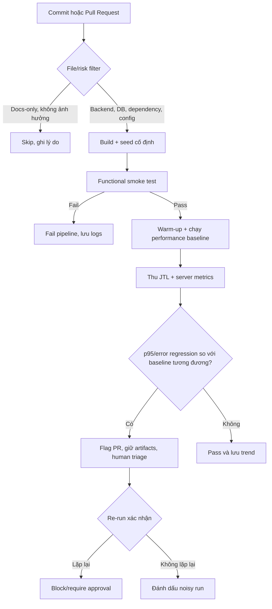

# HW05 – AI-Assisted Performance Testing Report

## Thông tin bài làm

| Trường | Giá trị |
| --- | --- |
| Student ID | 23127104 |
| Họ và tên | `TODO (STUDENT INPUT REQUIRED)` |
| Workflow | Workflow 5 – Admin Catalog & Promo Operations |
| SUT | EShop |
| SUT repository | <https://github.com/ttbhanh/eshop-sut> |
| SUT commit được test | `TODO (REAL COMMIT SHA REQUIRED)` |
| Test tool | Apache JMeter `TODO (REAL VERSION REQUIRED)` |
| AI tool(s) | OpenAI Codex; `TODO (DECLARE ALL OTHER REAL AI TOOLS)` |
| Ngày thực hiện | `TODO (REAL EXECUTION DATES REQUIRED)` |
| Public repository | `TODO (REAL URL REQUIRED)` |
| Demo video | `TODO (REAL UNLISTED YOUTUBE URL REQUIRED)` |

## 1. Tuyên bố sử dụng AI

> I use AI tools for the following tasks.

AI được dùng để phân tích đề, đề xuất/review thiết kế test, hỗ trợ xây Agent Skill, phân tích kết quả JTL và rà soát tài liệu. Mọi output AI được người thực hiện kiểm tra; các log tương tác nằm trong [AI_AUDIT_REPORT.md](AI_AUDIT_REPORT.md). Raw JTL, screenshots, hardware evidence, video, timestamps và kết quả đo không do AI tạo.

## 2. Mục tiêu và phạm vi

Mục tiêu là đánh giá hiệu năng backend EShop bằng Load, Stress, Spike và một short soak test trên cùng workflow quản trị. Ba nhóm endpoint được bao phủ trong một vòng nghiệp vụ:

| Bước | Nhóm | Method và endpoint | Mục đích |
| ---: | --- | --- | --- |
| 1 | Auth-heavy | `POST /api/login` | Đăng nhập admin và lấy JWT |
| 2 | Read-heavy | `GET /api/admin/users` | Đọc danh sách người dùng |
| 3 | Read-heavy | `GET /api/coupons` | Đọc danh sách voucher |
| 4 | Transactional | `POST /api/categories` | Tạo category riêng cho iteration |
| 5 | Transactional | `POST /api/products` hoặc `POST /api/admin/import-products` | Tạo/import sản phẩm thuộc category vừa tạo |
| 6 | Transactional | `POST /api/admin/coupons` | Phát hành voucher có code duy nhất |

Ngoài phạm vi: frontend rendering, mobile app và endpoint không thuộc Workflow 5. Kết quả trên localhost chỉ đại diện cấu hình phần cứng/môi trường đã ghi, không đại diện production.

## 3. Cơ sở đặc tả và source review

Nguồn được dùng:

- [HW05 assignment](../docs/hw05.md).
- [EShop requirements](https://github.com/ttbhanh/eshop-sut/blob/main/README.md).
- [API specification](https://github.com/ttbhanh/eshop-sut/blob/main/api_specification.md).
- [Backend implementation](https://github.com/ttbhanh/eshop-sut/blob/main/backend/server.js).

Source review trước khi thiết kế cho thấy các rủi ro sau:

| Quan sát | Ảnh hưởng đến test | Cách xử lý |
| --- | --- | --- |
| Token được trả ở `$.token` | Request sau phụ thuộc login | Dùng JSON Extractor và Bearer header |
| Category creation trả `id` | Product cần category hợp lệ | Correlate `$.id` sang payload product |
| Coupon code UNIQUE | Rerun/code trùng tạo lỗi 500 giả | Dữ liệu duy nhất theo run/VU/row |
| Import endpoint nhận JSON array do frontend parse CSV | Upload multipart sẽ sai contract thực thi | Gửi `{ "products": [...] }` nếu chọn import |
| `POST /api/products` thiếu auth middleware; nhiều route không check admin role | Lệch FR-12/SEC-03, là lỗi authorization | Gửi token để workflow nhất quán; báo riêng, không gọi là lỗi performance |
| Login sai tăng +2 và khóa 180 s, khác đặc tả +1/30 s | Có thể gây 403 kéo dài và làm hỏng run | Chỉ dùng credential đúng; có runbook recovery |

## 4. Môi trường kiểm thử

### 4.1 Hardware

| Thành phần | Giá trị thực |
| --- | --- |
| Hostname | `TODO (REAL HARDWARE EVIDENCE REQUIRED)` |
| CPU | TODO |
| Cores/threads | TODO |
| RAM | TODO |
| Storage | TODO |
| OS/build | TODO |
| Network topology | `TODO (localhost/LAN + details)` |

Hardware screenshot/report: `TODO (REAL PATH/LINK REQUIRED)`.

### 4.2 Software

| Phần mềm | Version/config thực |
| --- | --- |
| Node.js | TODO |
| npm | TODO |
| JDK | TODO |
| JMeter | TODO |
| EShop backend | commit TODO, port 3000 |
| SQLite/database state | TODO |

### 4.3 Kiểm soát môi trường

`TODO (REAL DESCRIPTION REQUIRED: processes closed, warm-up, same machine or separate load generator, clock/timezone, database reset policy)`.

## 5. Thiết kế dữ liệu và correlation

CSV có các nhóm trường: credential; `run_id`/`row_seed`; category; product/import; coupon. Dữ liệu mutation phải duy nhất, UTF-8 và đủ dòng cho số VU khi `Recycle on EOF=false`, `Stop thread on EOF=true`.

Chuỗi correlation:

```text
login response $.token
  -> Authorization: Bearer ${token}
create category response $.id
  -> product.category_id = ${category_id}
```

Credential production không được commit. File CSV thực và số dòng: `TODO (REAL FILES/COUNTS REQUIRED)`.

## 6. Thiết kế chung của JMeter plan

Mỗi plan chứa HTTP Request Defaults, JSON Header Manager, CSV Data Set Config, Thread Group tương ứng, Transaction Controllers, HTTP samplers, JSON Extractors, assertions, timers và JTL writer. Trước full run phải pass smoke test 1 VU × 1 iteration.

Assertions tối thiểu:

- response code đúng với implementation được test;
- login có token không rỗng;
- create operations có ID/message thành công;
- response không chứa lỗi database/auth;
- dependency failure dừng iteration phù hợp.

Full load chạy non-GUI. Listener GUI nặng được disable trong measurement nếu cần; việc này phải được ghi trong run notes.

## 7. Task 1 – Load test

### 7.1 Mục tiêu và cấu hình cuối

| Thuộc tính | Giá trị |
| --- | --- |
| Test plan | `23127104_Load_TODO-REALDATE.jmx` |
| Threads/VUs | `TODO (REAL FINAL CONFIG)` |
| Ramp-up | TODO |
| Steady duration/iterations | TODO |
| Think time/pacing | TODO |
| Listener/report type | Summary Report |
| CSV | TODO |
| SLO/acceptance criteria | `TODO (DECLARED BEFORE RUN)` |

Baseline AI gợi ý là 20 VU, ramp-up 120 giây và giữ 8 phút. Cấu hình trên chỉ là điểm hiệu chỉnh; bảng phải ghi cấu hình cuối thực sự chạy và lý do thay đổi.

### 7.2 Human review của plan

| AI proposal/omission | Human verdict | Correction và lý do |
| --- | --- | --- |
| Dùng workflow admin với mutation liên tục | Conditional | Bổ sung unique run/VU data để tránh coupon collision |
| Dùng Bearer token sau login | Correct | Trích `$.token`, assert non-empty |
| Không cấu hình Listener nào trong các file JMX (Load, Stress, v.v.) dù đã yêu cầu trong Profile | Incorrect | AI tập trung vào logic tạo tải mà bỏ qua phần trích xuất report. Đã tự add thêm Summary/Aggregate Report vào từng Thread Group. |
| Bỏ sót Response Assertion ở các API quan trọng | Incorrect | AI giả định mọi request đều trả về 200 OK hợp lệ (Happy path). Đã tự thêm Assertion để check response code và chuỗi "Product created". |
| Bỏ quên cơ chế bẫy lỗi Account Lockout (sai 3 lần khóa 180s) | Incorrect | LLM không mô phỏng được trạng thái DB thực tế (Stateful) khi chịu tải. Đã ghi nhận để chú ý khi chạy tải. |
| Sử dụng Include Controller với đường dẫn CSV tương đối `../test-data/admin_credentials.csv` | Conditional | Rất dễ gây lỗi File Not Found khi mở bằng JMeter GUI ở thư mục khác. Đã sửa lại thành đường dẫn tuyệt đối tới file CSV. |
| Sử dụng UltimateThreadGroup cho Stress/Spike test mà không báo trước | Incorrect | File JMX sẽ bị lỗi khi mở nếu JMeter chưa cài Custom Thread Groups plugin. Cần cài đặt plugin qua JMeter Plugins Manager để chạy được kịch bản Stress và Spike. |

### 7.3 Execution evidence và kết quả

| Metric | Overall | Login | Reads | Category | Product/import | Coupon |
| --- | ---: | ---: | ---: | ---: | ---: | ---: |
| Samples | TODO | TODO | TODO | TODO | TODO | TODO |
| Error rate | TODO | TODO | TODO | TODO | TODO | TODO |
| Throughput (samples/s) | TODO | TODO | TODO | TODO | TODO | TODO |
| Mean (ms) | TODO | TODO | TODO | TODO | TODO | TODO |
| p50 (ms) | TODO | TODO | TODO | TODO | TODO | TODO |
| p95 (ms) | TODO | TODO | TODO | TODO | TODO | TODO |
| p99 (ms) | TODO | TODO | TODO | TODO | TODO | TODO |
| Max (ms) | TODO | TODO | TODO | TODO | TODO | TODO |

Response codes, CPU/RAM/disk observations, raw JTL, HTML report và screenshots: `TODO (REAL EVIDENCE REQUIRED)`.

Kết luận Load: `TODO (EVIDENCE-BACKED CONCLUSION REQUIRED)`.

## 8. Task 1 – Stress test

### 8.1 Mục tiêu và cấu hình cuối

| Thuộc tính | Giá trị |
| --- | --- |
| Test plan | `23127104_Stress_TODO-REALDATE.jmx` |
| Stage/VUs | `TODO (REAL FINAL STAGES)` |
| Duration per stage | TODO |
| Recovery | TODO |
| Listener/report type | Aggregate Report |
| Stop/saturation criteria | TODO |

Baseline AI gợi ý các bậc 10→20→40→60 VU, mỗi bậc 2 phút. Phải sửa theo smoke/load baseline và năng lực máy.

### 8.2 Kết quả theo stage

| Stage | Time window | VUs | Throughput | p95 | Error rate | CPU | RAM | Verdict |
| --- | --- | ---: | ---: | ---: | ---: | ---: | ---: | --- |
| 1 | TODO | TODO | TODO | TODO | TODO | TODO | TODO | TODO |
| 2 | TODO | TODO | TODO | TODO | TODO | TODO | TODO | TODO |
| 3 | TODO | TODO | TODO | TODO | TODO | TODO | TODO | TODO |
| 4 | TODO | TODO | TODO | TODO | TODO | TODO | TODO | TODO |

First sustained breach: `TODO (REAL EVIDENCE REQUIRED)`.

Highest stable stage: `TODO (REAL EVIDENCE REQUIRED)`.

Failure mode và recovery: `TODO (REAL RESPONSE CODES/RESOURCE LOGS REQUIRED)`.

## 9. Task 1 – Spike test

### 9.1 Mục tiêu và cấu hình cuối

| Thuộc tính | Giá trị |
| --- | --- |
| Test plan | `23127104_Spike_TODO-REALDATE.jmx` |
| Baseline VUs/duration | TODO |
| Spike VUs/rise time/hold | TODO |
| Recovery VUs/duration | TODO |
| Listener/report type | View Results Tree cho debug; `TODO (REAL FULL-RUN OUTPUT)` |
| Recovery criteria | TODO |

Baseline AI gợi ý 10 VU → 80 VU trong không quá 10 giây, giữ 60 giây → 10 VU trong 2 phút. Cấu hình cuối phải dựa trên Load/Stress thực.

### 9.2 Kết quả theo phase

| Phase | Throughput | p95 | Error rate | CPU/RAM | Observation |
| --- | ---: | ---: | ---: | --- | --- |
| Pre-spike | TODO | TODO | TODO | TODO | TODO |
| Spike | TODO | TODO | TODO | TODO | TODO |
| Recovery | TODO | TODO | TODO | TODO | TODO |

Recovery time và kết luận: `TODO (REAL EVIDENCE REQUIRED)`.

## 10. Account lockout và state recovery

Test chính chỉ dùng password đúng. Nếu có 403 do lockout, run bị dừng; response/time được lưu; chờ interval quan sát được hoặc reset database bằng quy trình chính thức; sau đó chạy lại smoke 1 VU. Việc reset làm mất generated data phải được ghi lại.

Lần recovery thực tế (nếu có): `TODO (REAL STEPS/EVIDENCE OR STATE "NOT TRIGGERED")`.

## 11. Endurance/soak threshold

| Thuộc tính | Kết quả thực |
| --- | --- |
| Workload và duration (10–15 phút) | TODO |
| Stable RPS | TODO |
| p95 | TODO |
| Error rate | TODO |
| CPU range/peak | TODO |
| Memory start/peak/end | TODO |
| Disk/other resource | TODO |
| Stability criteria | TODO |

**Endurance threshold trên hardware này:** `TODO (REAL MEASURED VALUE AND LIMITING CONDITION REQUIRED)`.

Không được suy ra threshold từ thread count đề xuất; kết luận phải dựa trên JTL và resource trend cùng cửa sổ.

## 12. Task 2 – AI analysis và misinterpretation hunt

### 12.1 AI analysis

AI tool, prompt, input artifact/checksum, output: `TODO (REAL INTERACTION/AUDIT ENTRY REQUIRED)`.

### 12.2 Human correction

| AI claim | Giá trị đúng từ raw JTL | Verdict | Giải thích/correction |
| --- | --- | --- | --- |
| `TODO (REAL AI CLAIM)` | TODO (file/label/window/value) | TODO | TODO |
| `TODO (REAL AI CLAIM)` | TODO | TODO | TODO |
| `TODO (REAL AI CLAIM)` | TODO | TODO | TODO |

Phương pháp percentile và công cụ đối chiếu: `TODO (REAL METHOD REQUIRED)`.

### 12.3 Optimization feasibility

| AI recommendation | Classification | Evidence | Human judgement |
| --- | --- | --- | --- |
| Database index | Conditional | Cần slow query/query plan và workload read | Không khẳng định lợi ích nếu chưa có evidence |
| SQLite WAL/batching writes | Conditional | Cần dấu hiệu write contention/disk/locking | Có thể phù hợp mutation-heavy workload nhưng phải benchmark A/B |
| Connection pool | Unsupported until verified | Cần xem driver/access pattern | Không tự động phù hợp với SQLite chỉ vì phổ biến ở DB server |
| `TODO (REAL AI RECOMMENDATION)` | TODO | TODO | TODO |

## 13. Bugs và performance issues

| ID/link | Loại | Summary | Evidence | Trạng thái |
| --- | --- | --- | --- | --- |
| TODO hoặc “Không ghi nhận” | Functional/security/performance | TODO | TODO | TODO |

Các sai lệch source đã biết chỉ được tạo Issue sau khi tái hiện trên đúng commit. Không báo một finding source-only như thể đã được quan sát trong performance run.

## 14. Task 3 – Continuous Performance Testing proposal



### 14.1 Quy tắc quyết định

Pipeline chạy performance test khi commit chạm backend route/middleware, database/schema/query, dependency runtime, cấu hình hoặc test workload. Docs-only có thể skip nhưng phải lưu lý do. PR chạy profile ngắn; nightly/release chạy Load/Stress/soak sâu hơn.

Baseline phải versioned và được tạo trong môi trường tương đương. Regression gate nên kết hợp mục tiêu tuyệt đối với thay đổi tương đối, ví dụ `p95 > SLO` hoặc `p95 tăng > X%`, đồng thời kiểm error rate và sample count. `X` và SLO: `TODO (CHOOSE FROM REAL BASELINE)`.

### 14.2 Trade-offs

- **Cost**: dedicated runner giảm nhiễu nhưng tăng chi phí; profile ngắn trên PR và sâu vào nightly cân bằng thời gian.
- **False alarms**: shared CPU, warm-up, garbage collection, antivirus và background I/O làm p95 dao động; dùng warm-up, lặp lại và môi trường cố định.
- **False negatives**: filter commit có thể skip thay đổi gián tiếp; dependency/config/schema luôn nên kích hoạt.
- **Baseline drift**: không tự động chấp nhận baseline xấu; thay baseline cần review và liên kết lý do.
- **Statistical confidence**: ít mẫu khiến p95/p99 bất ổn; gate cần minimum sample count.
- **Triage**: pipeline chỉ flag regression, không tự tuyên bố root cause.

## 15. AI Critique

Xem [AI_CRITIQUE.md](AI_CRITIQUE.md). Bản critique chỉ được hoàn tất sau khi thay các placeholder bằng một misinterpretation có thật từ Task 2 và kiểm tra độ dài 200–300 từ.

## 16. Demo video

| Mốc thời gian | Nội dung |
| --- | --- |
| TODO | Workflow, environment, test data |
| TODO | Load/Stress/Spike configuration và execution |
| TODO | Tool + resource monitor cùng frame |
| TODO | Results, endurance threshold, AI correction |
| TODO | Agent Skill demo end-to-end |

Video URL: `TODO (REAL UNLISTED YOUTUBE URL REQUIRED)`.

## 17. Human review tổng kết

| Nội dung AI hỗ trợ | Điều người thực hiện xác minh/sửa | Bằng chứng |
| --- | --- | --- |
| Endpoint/workflow mapping | Đối chiếu API spec và backend source | Source links ở mục 3 |
| Workload seed | Hiệu chỉnh theo smoke/load và hardware | TODO |
| JTL metrics | Cross-check raw JTL/JMeter và method | TODO |
| Optimization | Phân loại theo source/resource evidence | TODO |
| Documentation | Audit placeholder, links và artifact inventory | Checklist |

## 18. Kết luận và giới hạn

`TODO (EVIDENCE-BACKED CONCLUSION REQUIRED: answer Load/Stress/Spike behavior, threshold, bottleneck evidence, AI lesson and limits).`

Các giới hạn bắt buộc thảo luận nếu áp dụng: SUT và load generator cùng máy; localhost không có network variability; thời lượng soak ngắn; SQLite; sample size; dữ liệu tăng qua mutation; listener overhead; background processes.

## Phụ lục A – Artifact index

| Artifact | Đường dẫn/link thực | Trạng thái |
| --- | --- | --- |
| Load JMX/CSV/JTL/HTML | `jmeter/23127104_Load_20260830.jmx`, `test-data/admin_credentials.csv`, `results/23127104_Load_20260830.jtl`, `results/load-report/` | Đã có |
| Stress JMX/CSV/JTL/HTML | `jmeter/23127104_Stress_20260830.jmx`, `test-data/admin_credentials.csv`, `results/23127104_Stress_20260830.jtl`, `results/stress-report/` | Đã có |
| Spike JMX/CSV/JTL/HTML | `jmeter/23127104_Spike_20260830.jmx`, `test-data/admin_credentials.csv`, `results/23127104_Spike_20260830.jtl`, `results/spike-report/` | Đã có |
| Soak JTL/report | `jmeter/23127104_Soak_20260830.jmx`, `test-data/admin_credentials.csv`, `results/23127104_Soak_20260830.jtl`, `results/soak-report/` | Đã có |
| Hardware/resource screenshots | `evidence/23127104_Hardware_20260830.png`, `evidence/23127104_Load_Evidence_20260830.png`, `evidence/23127104_Stress_Evidence_20260830.png`, `evidence/23127104_Spike_Evidence_20260830.png`, `evidence/23127104_Soak_Evidence_20260830.png` | Đã có |
| Server logs/run notes | TODO | Missing real evidence |
| GitHub Issues | TODO | Missing or none observed |
| Demo video | TODO | Missing real evidence |
| Git commit log text | TODO | Export after real commits |

## Phụ lục B – AI Audit Report

Xem [AI_AUDIT_REPORT.md](AI_AUDIT_REPORT.md).
